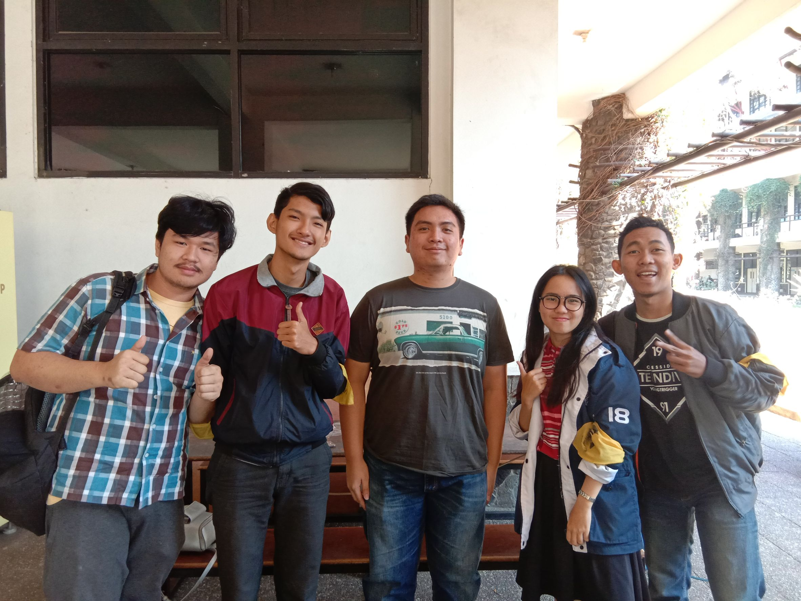

# Tugas Wawancara Daemon
<table>
  <tr>
    <td><b>Nama</b></td>
    <td>Ahmad Izzan</td>
  </tr>
  <tr>
    <td><b>NIM</b></td>
    <td>13516116</td>
  </tr>
  <tr>
    <td><b>Tanggal</b></td>
    <td>Jumat, 23 Agustus 2019</td>
  </tr>
  <tr>
    <td><b>Tempat</b></td>
    <td>Selasar Timur Labtek V ITB</td>
  </tr>
</table>

___

**Pewawancara:**
* 16518043  Vhydie Gilang Christianto The
* 16518103  Hardy Valenthio Amansyah
* 16518124  Wita Dewisari Tasya
* 16518217  Naufal Alim Wahib

___

&emsp;Pada tanggal 23 Agustus 2019, kami berlima melakukan wawancara kepada Kak **Ahmad Izzan** atau biasa dipanggil Kak Izzan. Kakak ini jurusan informatika dan berasal dari angkatan 2016.Di HMIF, kakak ini memiliki peran yang cukup penting. Ia menjadi Vice President of Department of Technology. Departemen ini adalah departemen yang baru ada di tahun kepengurusan ini. Awalnya, ia hanya membuat grup chat di sosial media untuk beberapa anak HMIF. Grup tersebut digunakan untuk sharing persoalan magang dan pengetahuan lainnya. Namun, hal tersebut diketahui Kak Akbar Ghifari (Ketua Himpunan). Oleh karena itu, Kak Abay mengajak Kak Izzan untuk memegang jabatan tersebut. Setelah menjabat, ia sangat sering mengadakan sharing mengenai internship. Selain itu, ia juga sering mengadakan bootcamp bersama teman-teman yang berada di departemen ini.

&emsp;Meskipun lumayan aktif di organisasi, Kak Izzan juga tidak lupa mengurus akademiknya. Apalagi, ia sudah berada di tingkat akhir yang sebentar lagi bisa lulus. Ia pun bernostalgia mengenai tugas besar terberat yang pernah ia jalani. Menurutnya, tugas besar yang paling berat ialah saat mata kuliah OS (Operating System). Namun, ia mengatakan bahwa tugas besar yang terlalu berat adalah tugas yang mudah. Dengan tugas yang sangat berat, ia akan cenderung melihat punya temannya karena tidak bisa mengerjakannya sendirian. Jadi, menurutnya, tugas besar terberat sebenarnya ialah tugas yang memiliki level menengah. Tugas besar dengan level menengah akan lebih menantang karena bisa dikerjakan meskipun sulit. Apalagi ketika timnya memiliki anggota yang suka menghilang saat pengerjaan tugas.

&emsp;Selain itu, Kak Izzan pernah di close recruit oleh kak Adi "_Musang_" Pradhana untuk menjadi anggota data arkav pada Arkavidia 5.0. Ia pun menjadi panitia karena direkrut oleh kak Adi. Program kerjanya waktu itu adalah Data Academy dan dia menjadi seorang HRD dalam data arkav, yaitu jadi penyeleksi CV, wawancara, dan menerima peserta. 

&emsp;Saat membahas mengenai hal favorit, kami membahas banyak hal. Kami pun bertanya sesuatu yang sangat tidak mungkin dan imajinatif. Saat ditanyai mengenai ingin menjadi hewan apa, Kak Izzan memilih menjadi beruang atau panda. Alasan yang ia utarakan juga sangat sederhana. Ia ingin menjadi kedua hewan tersebut karena mereka termasuk jenis hewan yang paling sering tidur dan terlihat sangat santai. Ia ingin menjadi hewan jenis itu agar tidak melakukan apa-apa selain makan dan tidur. Lalu, ketika ditanyai mengenai negara yang ingin dikunjungi, ia memilih Amerika. Bahkan, ia mau mencoba tinggal di sana selama beberapa tahun, tidak sekedar melakukan kunjungan atau liburan selama beberapa minggu. Ia menganggap bahwa aturan yang ada di Amerika sangat cocok dengan apa yang ia suka, termasuk kebebasan. Namun, ia juga mengatakan bahwa ketika tinggal di sana harus berhati-hati. Hal tersebut disebabkan oleh legalnya senjata berapi untuk masyarakat awam di sana.

&emsp;Kak Izzan memiliki rencana untuk bekerja terlebih dahulu karena pengalaman yang nyata akan di dapatkan saat bekerja. Kak Izzan berpendapat jika kita hanya kuliah terus tanpa bekerja maka ilmu kehidupan tidak bisa kita peroleh. Kak Izzan juga memikirkan untuk S2 tapi itu sangat tergantung dari situasi dan kondisi ke depannya, yang utama yang ingin dikerjakan terlebih dahulu adalah bekerja. Saat ditanya untuk menikah Kak Izzan tidak mau menjawab dengan tegas karena dia masih ingin mengeksplore diri lebih jauh seluas-luasnya dan sejauh-jauhnya sebelum memutuskan untuk cukup dan jenuh lalu menjalani hidup seperti biasa.

&emsp;Pertama kali ketemu dengan Kak Izzan, orangnya sangat friendly dan mudah mencairkan suasana. Meskipun wawancara yang kami lakukan termasuk cukup pagi (jam 8 pagi), namun wawancara berjalan dengan sangat baik dan penuh tawa. Bila dilihat dan diambil acuan saat wawancara, menurut kami, Kak Izzan orangnya memiliki banyak teman. Bahkan, dari gaya bicaranya, Ia terlihat memiliki pengetahuan yang luas tentang keinformatikaan. Apalagi, dengan menjadi Vice President, ilmu keinformatikaannya pasti akan bertambah. Intinya, wawancara dengan Kak Izzan cukup berkesan di hati kami.

## Kenapa pilih teknik informatika dari enam jurusan yang ada di STEI kak?
Karena dari awal sebelum memilih STEI sudah menetapkan mau IF. Justru, dulu bingungnya antara ekonomi dan informatika. Kak Izzan ini sempat ikut Simak UI loh!

## Kalau begitu, kenapa ga STI aja? Ga berubah pikiran?
Jawabannya cukup sederhana namun dimengerti semua pewawancara. "Oh iya bener juga"
Hanya dengan jawaban seperti itu, Kak Izzan ini mampu membuat semua pewawancara yang isinya anak STI ketawa-ketawa kecil

## Unit Kegiatan Mahasiswa (UKM) apa yang kakak ikuti?
Dia mengikuti unit Amateur Radio Club dan pernah di close recruit menjadi ketua knowledge dev pada unit itu. Untuk sekedar info, Amateur Radio Club (ARC) adalah unit yang bergerak dibidang _networking_ dan _web development_. 
