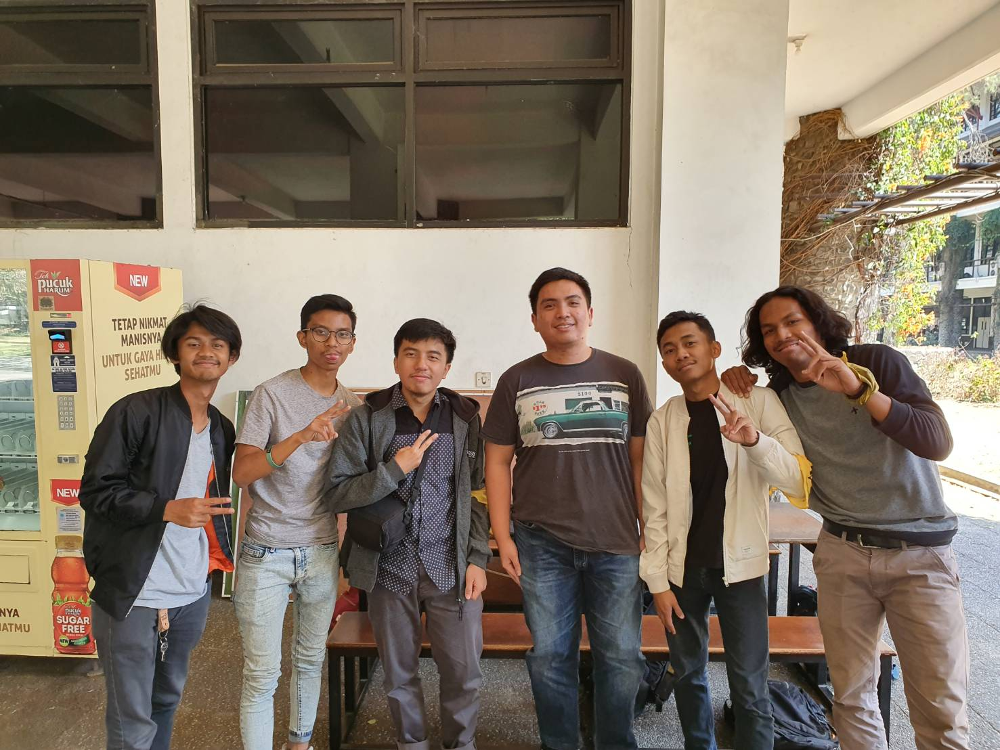

Pada 23 Agustus 2019 pagi hari kami mewawancarai kak Izzan di selasar timur Labtek V ITB. Kak Izzan ini memiliki nama lengkap Ahmad Izzan dan merupakan mahasiswa Teknik Informatika tahun angkatan 2016. Di HMIF Kak Izzan menjabat sebagai ketua Departemen Teknologi, dan pernah diangkat menjadi *staff* acara di Arkavidia. Kak Izzan mau menjabat sebagai ketua Departemen Teknologi karena diajak Kak Abay yang melihat bahwa Kak Izzan sering membuat acara-acara keprofesian sendiri dan disugestikan Kak Abay untuk menjadikan acara-acara seperti itu dinaungi oleh HMIF. Kalau untuk menjadi panitia Arkavidia, Kak Izzan mengaku awalnya tidak mengisi *Open Recruitment* Arkavidia tapi akhirnya ditarik teman menjadi panitia acara di Arkavidia.

Sebagai ketua Departemen Teknologi, Kak Izzan memiliki beberapa proker yang meliputi Bootcamp--yang kabarnya memiliki enam cabang--, Internship Sharing, serta Techblog. Kak Izzan mengaku semua prokernya berjalan dengan baik dan akan kembali mengadak Internship Sharing dan Bootcamp pada semester ini. Kak Izzan juga menyatakan proker Techblog miliknya tidak pernah loyo dan terus secara berkala diperbarui.

---Pertanyaan Bebas---

Mengingat Kak Izzan ini jurusan Teknik Informatika yang sudah mau lulus, tentunya Kak Izzan memiliki banyak pengalaman tentang kuliah di Teknik Informatika dan mengingat ada beberapa dari kami yang Tenik Informatika juga, terbesit di pikiran kami untuk meminta *spoiler* ke Kak Izzan. Kami pun bertanya kepada Kak Izzan tentang Tugas Besar yang paling berkesan baginya. Menurut Kak Izzan Tugas Besar yang paling berkesan adalah Tugas Besar *Operating System* (OS) karena tugasnya *sangat* sulit. Tugas Besar OS ini saking sulitnya hingga Kak Izzan bercerita satu angkatannya melihat ke satu sumber dan melakukan berbagai modifikasi terhadap sumber tersebut untuk menyelesaikan tugas tersebut.

Selama wawancara, Kak Izzan sempat menyebutkan bahwa dirinya melakukan magang saat acara SPARTA angkatannya berlangsung dan sempat tertinggal sekitar satu bulan acara. Dari hal tersebut kami menanyakan pakah saat hadir di SPARTA merasa canggung dulu atau langsung nyaman dengan acara SPARTA ini dan angkatannya. Kak Izzan mengatakan cukup mudah nyaman saat hadir di SPARTA karena *mindset* orang-orang yang mengikutinya adalah untuk saling berkenalan seangkatan. Akan tetapi, Kak Izzan mengaku sempat canggung untuk ke *basecamp* karena yang lain sudah nyaman di sana selama sekitar sebulan dan orang-orang jadi heran Kak Izzan itu siapa waktu datang. Akan tetapi, akhirnya jadi cukup nyaman juga ke *basecamp* setelah beberapa kali janjian dengan teman yang memang sudah dekat untuk datang ke *basecamp* bersama-sama.

Harapan Kak Izzan di HMIF ini apakah ada yang sudah terwujud?
Kak Izzan ini pada awalnya berharap dari komunitas akan ada pertemuan rutin tiap minggu. Tapi ternyata, setelah pertemuan day 0 tidak ada lagi kumpul-kumpul lagi setelah itu.

Apa yang sudah didapat dari HMIF selama ini?
Hingga saat ini, Kak Izzan mendapat teman-teman yang bonding. Namun, Kak Izzan ini lebih suka belajar mandiri, karena memang cara belajarnya seperti itu. Kak Izzan juga sekarang tidak mengikuti komunitas.

Apakah Kak Izzan adalah seseorang yang sudah ngoding dari sebelum kuliah atau baru ngoding pas TPB?
Kak Izzan ini saat SMA memiliki tujuan untuk masuk ke jurusan Ekonomi namun masuk ke STEI ITB. Oleh karena itu Kak Izzan baru ngoding saat waktu TPB STEI.

Saat TPB apakah pilihan masuk Teknik Informatika pernah tergoyahkan atau tidak?
Tidak pernah goyah, karena saat masuk ke STEI ITB, emang tujuan awalnya untuk masuk Teknik Informatika.

Gimanasih istri idaman Kak Izzan ini?
Menurut kak Izzan, istri idamannya adalah cewe yang gaterlalu "religius" tapi bukan dalam makna buruk juga ternyata. Lalu pengennya yang lebih pendek dan orangnya baik (ga tengil gitu).

Kalo Kak Izzan bisa bikin suatu teknologi apapun pengennya bikin apa?
Kak Izzan pengen buat alat teleportasi. Kenapa alat teleportasi dan bukan yang lain. Karena Kak Izzan ini jadi bisa pulang Jakarta-Bandung gampang terus gaperlu telat - telat karena nungguin Ojek Online yang lama dan bisa makan dimana aja.

