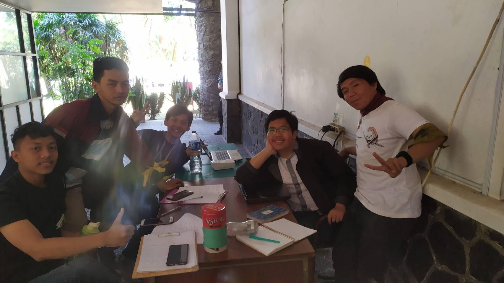

# Wawancaraqr

Selasar Dingdong jam 10.00 hari Jumat, 23 Agustus 2019

Pada saat itu, kami:

16518064 - Fatkhan Masruri

16518251 - Naufal Arfananda G.

16518172 - M. Rahadian Alamsyah

16518245 - Faris Rizki E.

Mewawancarai seseorang bernama Iqrar yang memiliki *codename* ~~Lyoko~~ qr

## Pengenalan

Kak Iqrar Aminullah, biasa dipanggil Iqrar atau Iqwaw, adalah seorang mahasiswa Teknik Informatika '16 dengan NIM 13516126. Dia merupakan Koor Tim Senator yang bertugas memantau tim senator agar dapat bekerja sesuai timeline. Ketika Kak Iqwaw memasuki HMIF, ia ingin mencoba hal baru. Waktu itu pilihannya antara Pengabdian Masyarakat, IIT, dan tim senator. Rupanya pengmas tidak cocok dengannya, dan IIT juga banyak yang mendaftar, sehingga Kak Iqrar pun memilih Tim Senator. Sebagai Koor Tim Senator, Kak Iqrar mempunyai proker yang dia jalankan dengan dibantu oleh senator, yaitu kumpul rutin tim senator tiap 2 minggu sekali. Hal ini dilakukan untuk mencegah agar orang-orang tidak hilang dan tetap fokus di kesenatoran. Pada kumpul rutin tersebut, mereka biasanya membahas isu-isu di KM ITB dan membahas kinerja kesenatoran juga walau dibalut dalam suasana santai. Fun fact: Kak Iqrar adalah ketua unit UKJ tahun 2018/2019.

## Pertanyaan Bebas

Banyak sekali cerita yang kami dapatkan dari Kak Iqrar, salah satunya adalah mitos yang ada di Labtek V. Katanya, pada malam hari kalau kalian melihat ke lantai 4 Labtek V dari arah intel, kalian dapat melihat ada lampu ungu disana. Menurutnya sih itu ada anak TA yang lagi mengerjakan sesuatu, karena disana terdapat beberapa instrumen untuk anak elektro mengerjakan TA-nya. Kak Iqrar juga menceritakan alasan dia masuk Informatika itu karena tidak suka PAR, dan ingin terus lanjut masuk HMIF karena butuh kenalan dan ingin mencoba hal-hal baru di dunia perkuliahan ini. Cerita paling seru mungkin tentang cerita KP (magang) kak Iqrar, ketika dia menjadi Web Developer full-stack di suatu perusahaan. Semuanya dia lalui, mulai dari front-end, back-end, seakan-akan dia adalah webdev satu-satunya disitu. Tetapi walau susah, banyak pengalaman yang Kak Iqrar dapatkan dari magang. Kak Iqrar pun ingin kerja di perusahaan besar internasional di luar negeri, terutama Jepang. Dia ingin berkecimpung di dunia AI kedepannya.

Seitap orang yang hidup didunia ini pasti tidak sempurna baik diri atau pekerjaan selama menjakani hidup. Kak Iqrar pun seperti itu, dia mempunyai penyesalan terbesar dalam hidupnya yaitu dia menyesalkan waktu yang telah berlalu tidak dikerjakan dengan maksimal. Misal dalam kehidupan perkuliah dia selalu menyesal pada semester 3 kenapa semester 2 dia tidak serius padahal seharunya di semester 2 dia bisa mendapatkan hasil yang lebih baik dari hasil yang telah didaptkan. Kak Iqrar pun sudah sadar bahwa dia masuk jurusan informatika dan informatika mempunyai banyak bidang. Dan sampai saat ini Kak Iqrar bercerita bahwa dirinya belom membuat suatu spesialisasi pada suatu bidang. Akan tetapi pada kuliah praktiknya Kak Iqrar berperan sebagai seorang web developer yang full-stack.
