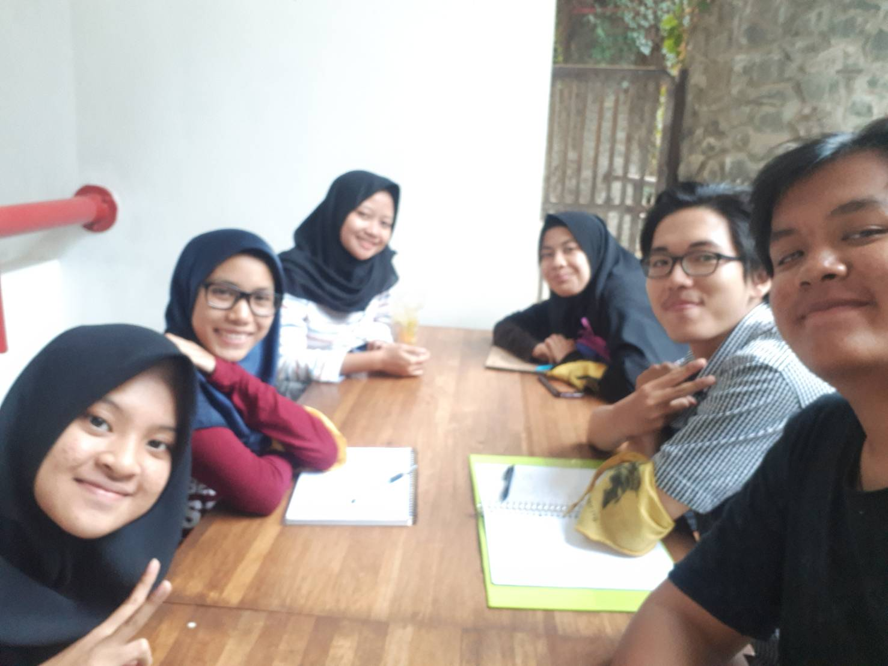

# Summary Wawancara Kak Rinda

Pada hari Kamis, 22 Agustus 2019 tepatnya pukul 16.00 kami dengan nama di bawah ini bertemu dan berbincang barengn kak Rinda di selasar basdat.

Jingga Mutiara Windyarahma - 16518301
Yonatan Jori Saputro - 16518302
Christovito Hidajat - 16518350
Widad Istiqomah - 16518381

## Pertanyaan wajib

### Siapa ya Kak Rinda?

Rinda Nur Fafizha atau yang biasa dipanggil kak rinda ini mahasiswi Teknik Informatika ITB angkatan 2016. Asal Kak Rinda dari Jakarta, dan sebelumnya bersekolah di SMAN 81 Jakarta. 

### Peran Kak Rinda di DE / DPP / Arkavidia?

Saat ini kak Rinda sebagai Bendahara di DE HMIF 2019-2022, sebelumnya kak Rinda pernah jadi bendahara Arkavidia 2018.

### Kenapa memutuskan ambil peran tersebut?

Awalnya kak Rinda gamau jadi DE. Terus Kak Abay ngajak Kak Rinda buat jadi DE, ngeliat konsep di kepemimpinan Kak Abay yang mateng dan punya mimpi yang bagus buat HMIF, Kak Rinda jadi tertarik buat ikut kontribusi di DE ssebagai bendaharanya.

### Apa proker dari peran yang diambil?
Di bendahara DE HMIF 2019-2022 prokernya itu ada:
1. DanusMulus: Membuat jadwal danus kepanitiaan di HMIF agar berjalan mulus (tanpa bentrok);
2. saRAB: Membuat RAB untuk keperluan setahun;
3. SOPBuaH: SOP untuk departemen yang perlu mengurus hal-hal terkait keuangan;
4. EwRun: Iuran anggota, 20.000 per semester untuk tiga tahun pertama di HMIF;
5. LaporKakak: Laporan keuangan rutin tiap bulan melalui milis;
6. Buset: Pembukuan keuangan himpunan.

## Pertanyaan tambahan

### Di IF, Kakak tertarik KK apa?
Kak Rinda tertarik dengan KK Rekayasa Perangkat Lunak dan UX. Selain itu, Kak Rinda juga asisten praktikum matkul Rekayasa Perangkat Lunak.

### Apa passion kedua Kak Rinda setelah keinformatikaan?
Untuk passion kedua, Kak Rinda belum kepikiran, tapi akhir-akhir ini passionnya terhadap bidang keinformatikaan sedang meelsat tajam.

### Kenapa dulu masuk IF?
Kak Rinda masuk IF karena gasuka fisika tapi suka matematika.

### Apa pengalaman paling konyol di SPARTA?
Dulu, waktu jadi panitia, Kak Rinda disuruh ngajarin PBB karena anak MBWG. Tapi, karena PBB MBWG bida sama PBB biasa, jadinya malah lucu di hadapan peserta.

### Apakah kakak ngerasa wadah dan berbagai media di ITB untuk belajar ngoding itu udah sangat mencukupi?
Belum, masih banyak yang kurang. Jujur bahkan aku baru sekarang benar-benar merasakan bahwa aku bisa ngoding dan istilahnya 'jago' dalam ngoding gitu, baru di tingkat 4 ini sekarang. Ada banyak wadah di luar sana yang bisa ngebantu dalam belajar ngoding, jadi jangan mengandalkan apa yang ada di ITB saja.

### Menurut kakak, kenapa anak IF dan STI sulit untuk berkomunikasi?
Emang iya ya? Mungkin bisa dibilang iya, terutama mungkin di IF. Karena bisa saja sedari dulu lingkungan di tempat mereka berada itu mungkin cenderung tidak seterbuka lingkungan mereka sekarang di kampus ITB jadi mereka perlu waktu untuk adaptasi. Bisa juga mungkin karena mereka tidak terbiasa dengan tekanan yang ada di lingkungan mereka, jadi mereka memilih untuk bertindak 'aman'.

### Kak apa tips-tips supaya kita aktif berorganisasi atau istilahnya "tidak mager"?
Inget aja kita punya tanggung jawab lebih di organisasi tersebut, selain itu karena teman-teman Kak Rinda juga aktif berorganisasi

### Apa kelebihan dan kekurangan kakak?
Kelebihan dan kekurangan Kak Rinda adalah perfeksionis. Di satu sisi, perfeksionis menghasilkan hasil kerja yang bagus dan memuaskan, tetapi di sisi lain waktu yang diperlukan untuk menyelesaikan tugas tersebut semakin lama, menimbulkan rasa tidak cepat puas dan overthinking.

### Foto bersama

