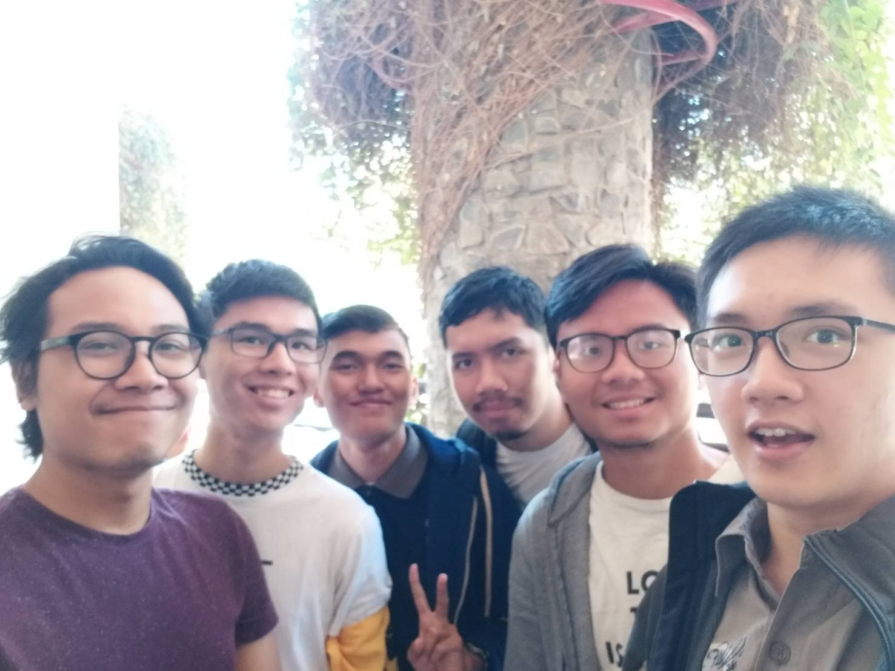

# SUMMARY WAWANCARA DAEMON FADHRIGA

## Pewawancara
- Indra Febrio Nugroho / 16518070
- Adriel Gustino Parlinggoman Situmorang / 16518225
- Felix Setiawan / 16518293
- Daniel Riyanto / 16518296
- Evan Pradanika / 16518333

Pada hari Rabu, 21 Agustus 2019, kami mewawancarai seorang Daemon yang bernama Muhammad Fadhriga Bestari.
Jurusannya adalah Teknik Informatika dan beliau adalah Kepala Komisi Perbaikan Sistem dari DPP (Dewan Perwakilan
& Pengawasan). Pada tahun sebelumnya, dia menjabat sebagai anggota suatu divisi di Arkavidia.

Kakak satu ini ingin memegang peran ini karena ingin melanjutkan AD/ ART dan melakukan amandemen pada AD/ART.
Proker, ide atau jobdesc yang pernah dijalani di bidang Komisi Perbaikan Sistem adalah mengurus Pemilu dan
menentukan ketua Pemilu, membuat rancangan amandemen AD/ ART dan lain-lain. Kak Fadhriga ditawarkan menjadi
Kepala Komisi Perbaikan Sistem oleh ketua DPP karena mereka berteman dekat. Awalnya, Kak Fadhriga bersedia menjadi
anggota DPP hanya untuk mengikuti yang tertulis di AD/ART. Setelah beberapa saat, Kak Fadhriga ingin DPP memiliki
tujuan selain untuk memenuhi yang diminta AD/ART, sehingga muncullah ide untuk melakukan amandemen AD/ART.

Saat pemilihan divisi magang berlangsung di HMIF, awalnya beliau ingin memilih menjadi anggota Tim Kesenatoran, tetapi diajak untuk menjadi anggota DPP. Lama-kelamaan Ka Fadhriga menjadi tertarik dengan hal-hal yang berhubungan dengan AD/ART. Menurutnya, nilai-nilai yang terdapat di HMIF dan tidak ada di himpunan lain adalah momen bersenang-senangnya. Saat mau memilih kuliah di ITB, dia memilih STEI karena melihat _passing grade_-nya yang paling tinggi. Ngomong-ngomong tentang unit, Kak Fadhriga tidak mengikuti unit apapun alias GNU. Padahal pada awalnya, dia mendaftar di dua unit, yaitu LSS dan Apres tetapi berhenti di tengah jalan.

Menurutnya, kebutuhan untuk mengubah atau mengamandemen AD/ ART masih menjadi wacana karena amandemen AD/ ART terakhir dilaksanakan pada tahun 2013/2014. Hampir semua bagian AD/ ART ingin diubah olehnya, seperti makna tentang warna jahim, mukadimah dan alasan tentang jumlah-jumlah orang begituan dan lain-lain. Saat wawancara, Kak Fadhriga juga tidak ingin adanya perbedaan antara Anggota Muda atau Angmud dan Anggota Biasa atau Angbis karena menurutnya tidak ada lagi perbedaan yang signifikan antara keduanya. Menurut dia, SPARTA itu hanya seperti LKO (Latihan Kepemimpinan Organisasi), jadi setiap orang berhak untuk tidak ikut serta di dalamnya.

  

