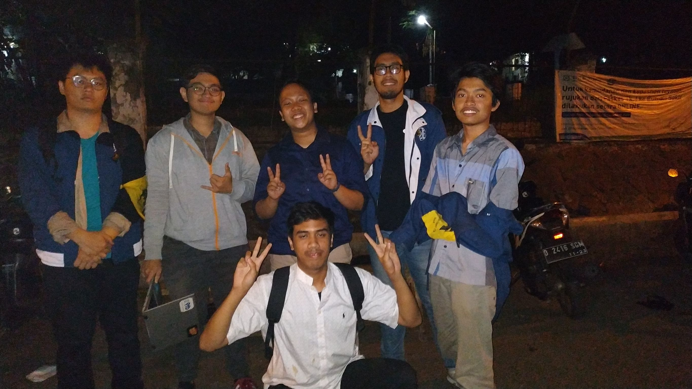

# Wawancara Daemon 'Gravity Falls'
Pada hari Selasa, 27 Agustus 2019 pukul .00, kami,
- 16518017 - Gregorius Jovan Kresnadi,
- 16518127 – Fabian Zhafransyah,
- 16518160 – Naufal Dean A,
- 16518183 – Rafi Abbel M,
- 16518407 – Jon Felix Germinian,

mewawancarai kak Akbar yang menggunakan nama sandi 'gravity falls'.

# Summary
## Biodata Singkat
  Nama lengkapnya adalah Akbar Ghifari. Nimnya 18218011. Jurusannya STI. Alasannya karena dia tidak suka par tapi suka daspro dan sedikit ada jiwa bisnis. Kenapa jadi kahim? Karena dulu ikut LFM, terus dia merasa budaya di LFM itu budaya udah meresap ke tiap anggotanya. Dia merasa lebih dan tau apa yang bisa diubah dari HMIF, dimulai dari unfreezing dahulu. Prokernya artikel yang bertujuan untuk mengenal HMIF lebih jauh. Kemudian, juga ada pemantauan dan appreciation night. Arkavidia, tahun kedua jadi pubdok dan tahun pertama jadi MSDM.

## Pertanyaan Bebas

### Jovan – Kenapa awalnya mau masuk STEI?
Awalnya mau masuk ke fakultas FTTM dan mau ngambil perminyakan, tapi ga diperbolehkan sama ibunya. Jadi waktu daftar SNMPTN, Kak Akbar mengambil pilihan pertama di STEI, dan pilihan keduanya di FTSL karena tadinya mau ngambil Teknik Kelautan. Tapi ternyata keterimanya jadi di STEI.

### Jovan – Tempat makan favorit di Bandung dan kenapa?
  Rumah Makan Malah Dicubo di dekat stasiun Bandung, menurut dia enak banget kuahnya dan tiap kali makan pasti ngerasa ngegendutin karena minyaknya banyak banget. Tetapi dia bertanya-tanya ke semua orang, termasuk ke Decrypt 2018, untuk mencari tempat makan enak lainnya.

### Dean - Cita-cita habis lulus?
Kak Akbar ingin membuat sebuah startup yang bergerak di bidang pendidikan. Pilihan lainnya adalah masuk ke perusahaan yang memberikan banyak dampak. Contohnya pertama, ke Eduka bareng kak Faiz. Atau, mau ke GOJEK, lebih spesifiknya kak Akbar mau menjadi Product Manager yang berhubungan dengan kesejahteraan driver GOJEK.

### Dean - Kemarin ke luar negeri ngapain?
Tepat sebelum wawancara, kak Akbar baru balik dari Bangkok. Di sana, dia semacam dikumpulkan oleh suatu perusahaan, yaitu Siam Cement Group. Di sana, dia mengikuti suatu simposium. Selain itu, dalam rangka kegiatan ini, kak Akbar mengerjakan suatu proyek gitu. FYI, dari Indonesia ada 10 perwakilan, 4 dari ITB. FYI lagi, kak Akbar juga pernah ikut program yang sama pas SMA dulu.

### Jon - Time Travel
Kak Akbar pengen ke masa depan untuk melihat bagaimana keadaaan di masa depan. Contoh yang kak Akbar berikan adalah perubahan iklim seperti kebakaran hutan di Kalimantan. Kak Akbar bersyukur karna udara di Bandung jauh lebih segar dibandingkan udara di Jakarta.

### Jon - Opini kak Akbar tentang perubahan iklim
Kodrat-nya manusia ini untuk merusak. Kak Akbar berpikir wajar karna manusia perlu merusak untuk pembangunan tetapi bisa dilakukan lebih baik. Kesadaran manusia untuk memperhatikan alam kurang di zaman sekarang. Manusia pintar tetapi kurang memikirkan aksi-aksi yang dilakukannya. 

## Hal-Hal yang Berkesan tentang Kak Akbar
 Awalnya kami meminta jadwal dengan Kak Akbar itu hari Rabu jam 10 pagi, tapi karena Kak Akbar baru pulang siang hari dari Bangkok, jadi jadwal kami diundur jadi jam 12 malam, dan kami harus bergegas mengisi repository GitHub. Kak Akbar itu walaupun Kahim dia santai banget orangnya, dan menurut dia budaya di ITB itu kurang “memanusiakan manusia”, maka dari itu dia lebih memilih untuk menyebut “anak-anak HMIF” daripada “massa HMIF”.

## Foto

