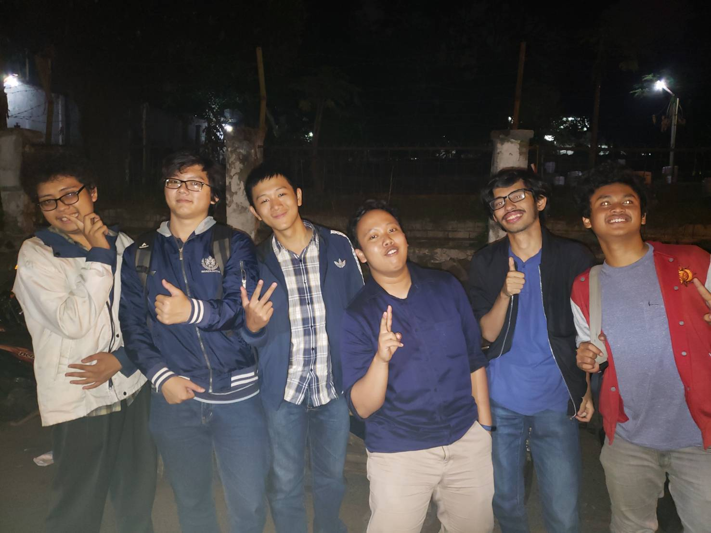

# Wawancara Daemon
## Akbar Ghifari

Pewawancara :
- Rafael Sean Putra - 16518145
- Mario Gunawan - 16518180
- Michael Hans - 16518192
- Fabianus Harry Setiawan - 16518339
- Rizkin Geordany - 16518408

## Deskripsi
Pada hari Selasa, tanggal 27 Agustus 2019, setelah day sparta, kami mendapatkan kesempatan yang special untuk mewawancarai daemon dengan codename ‘Gravity Falls’ yang tidak lain adalah ketua Himpunan kami sendiri yaitu kak Akbar Ghifari, atau yang akrab dipanggil dengan panggilan kak Abbay. Beliau adalah anak STI Angkatan 2016 yang menjabat sebagai ketua himpunan HMIF, yang tugasnya secara garis besar adalah mengatur keberjalanan organisasi HMIF itu sendiri. Kak Abbay menjadi ketua himpunan karena merasa bahwa masih banyak yang harus dibenahi dari HMIF dan hal tersebut tidak akan benar apabila tidak ada yang terjun secara langsung untuk membenahi hal tersebut. Pada periode kepemimpinannya ini, kak Abbay menekankan nilai eksplorasi diri dan juga empati.

## Pertanyaan
Kak Abay memiliki beberapa organisasi yang ingin diikuti. Salah satu organisasi tersebut adalah rektorat ITB, meskipun sebenarnya mahasiswa tidak boleh masuk. Selain itu, kak Abay ingin mengikuti Unit Majalah Ganesha. Menurut dia, kajian, terutama yang dilakukan Majalah Ganesha, sangatlah menarik. Kak Abay berpendapat bahwa kajian dapat membebaskan pemikiran kita dan dapat membuat kita mempertanyakan hidup kita.

Kak Abay ingin memiliki rumah yang tidak terlalu lebar. Dia ingin memiliki rumah dengan segala aspeknya memiliki fungsi, seperti tangga yang juga sebagai lemari sepatu. Selain itu, kak Abay juga ingin rumah yang memiliki penerangan dari luar. Kak Abay juga menginginkan rumah tersebut bertipe seperti rumah Jepang yang memiliki tempat-tempat untuk lesehan.

Tentu kak Abbay memiliki latar belakang dan alasan mengapa dia menjadi ketua himpunan, dan kami pun menanyakan hal tersebut. Ia pun bercerita, bahwa dulu, saat ia SMA di SMAN 1 Bogor, sudah ada budaya regenerasi kepengurusan OSIS yang penerapannya mengikuti konsep yang ada di perguruan tinggi, dan kak Abbay sudah mengalami yang Namanya Pendidikan dan cara kaderisasi yang keras sejak di SMA. Saat ia masuk ITB, terutama di HMIF, ia merasakan ada yang kurang dari organisasi ini, terutama budaya regenerasinya, dan ia merasa HMIF masih harus dibenahi dan dibuat dengan sistem yang terinspirasi dari SMA nya, sehingga akhirnya ia memilih menjadi kahim untuk membenahi kekurangan tersebut karena ia merasa bahwa sudah tanggung jawabnya untuk membenarkan yang salah dan bukannya malah lari dari masalah.

Tak hanya pertanyaan yang berat, pertanyaan random pun terlontar oleh kami. Kami bertanya apabila kak Abbay memiliki mesin waktu dan bisa menjelajahi waktu, ia akan pergi kemana. Ia pun menjawab bahwa daripada menggunakan mein waktu untuk pergi ke masa lalu dan melihat kejadian yang sebenarnya sudah tidak bisa untuk diubah, akan lebih baik bahwa ia pergi ke masa depan, karena ia ingin melihat kita manusia mengalami kiamat karena apa. Ia berpikir seperti itu karena ia merasa bahwa influence yang kita berikan tidak akan cukup untuk mengubah apa yang terjadi di masa lalu.

Pertanyaan mengenai kaderisasi pun kembali dilontarkan oleh kami. Terinspirasi dari pengalaman, kami pun bertanya kak Abbay lebih prefer untuk melantik satu Angkatan yang memiliki beberapa anggota yang sudah pasti akan hilang, atau mencoret beberapa anggota yang kurang aktif tersebut, dan memiliki satu Angkatan tidak lengkap yang memiliki anggota yang lebih jelas keaktifannya. Kak abbay pun masih bimbang dengan jawabannya, namun dia lebih prefer kelengkapan satu Angkatan yang diikuti dengan cara lebih mendekati anggota yang kurang aktif dan mengajaknya. Ia bilang bahwa kita harus menaruh hati kita untuk mereka, karena kita adalah satu Angkatan yang utuh.

Kak Abay telah menjabat peran-peran penting dalam perkuliahannya, seperti saat ini menjadi Ketua Himpunan HMIF, mengikuti Kerja Praktek, dan dahulu pernah menjadi wakil komandan batalyon saat mentor OSKM ITB 2017. Tentunya akan ada kekhawatiran atau rasa beban yang terjadi ketika mengambil peran-peran penting tersebut. Bagi Kak Abay sendiri, Kak Abay mampu mengatasi rasa khawatir dan beban tersebut. Untuk mengatasi kekhawatiran tersebut, Kak Abay kembali mengingatkan untuk mempertimbangkan segala hal sebelum mengambil peran tersebut. Ingat kembali tanggung jawab yang telah dipegangnya dan seyakin-yakinnya harus sanggup untuk mengambil tanggung jawab dari peran-peran yang telah diambilnya. Kak Abay berpesan bahwa lebih baik tidak mengambil sama sekali daripada mengambil tapi tidak menjalankan amanah atau tanggung jawab tersebut.

Lalu terkait beban-beban yang muncul akibat tanggung jawab tersebut, Kak Abay mempunyai satu motivasi tersendiri. Kak Abay mengingat akan dampak-dampak yang akan diberikannya kepada orang lain melalui perannya sebagai Ketua Himpunan. Bagi Kak Abay, semua yang dikerjakan harus diingat kembali untuk siapa dan ingat juga akan wadah pahala yang didapatkan dari dampak-dampak yang berhasil diberikannya itu. Kak Abay berpesan untuk jangan menganggapnya sebagai beban karena meskipun terlihat beban, namun ketika kita tidak menganggap beban maka beban tersebut tanggungannya akan ringan juga bila dijalankan.

Dalam kehidupan sehari-hari, pikiran Kak Abay selalu berjalan, mulai dari hal sederhana seperti mandi, makan, kuliah. Kemudian mengingat jabatan Kak Abay sebagai ketua himpunan, tentunya di pikiran Kak Abay sendiri seringkali terpikirkan akan keberjalanan HMIF itu sendiri beserta job-job yang harus ia kerjakan dan harus ia awasi perkembangan dari job-job rekan-rekan HMIF. Kak Abay terus memastikan bahwa segala to do list terkait HMIF akan terus dikerjakan dan terus terselesaikan secara tepat waktu dan tidak ada yang keteteran.

Selama ini Kak Abay belum merasakan penyesalan dalam masalah akademik. Kalau dalam non-akademik, penyesalan Kak Abay muncul pada saat dia mengikuti kaderisasi Skhole pada saat masih TPB. Karena pada awalnya kurang aktif (seperti jarang datang day), muncul rasa tidak enak terhadap rekan-rekan Skhole pada diri Kak Abay. Dalam diri Kak Abay, terbesit pikiran bahwa seandainya dia aktif ketika masih awal, dia dapat menjadi lebih enak berhadapan dengan rekan-rekannya di organisasi manapun kelak. Hal ini membangun kecenderungan Kak Abay untuk lebih aktif setidaknya pada awal kaderisasi setiap organisasi, seperti ikut makan-makan bersama rekan seorganisasinya.

Menurut Kak Abay, organisasi kemahasiswaan di ITB yang under-rated pada saat ini adalah Kabinet KM ITB periode 2019. Hal ini terlihat dengan banyaknya mahasiswa yang menganggap bahwa Kabinet KM ITB itu merupakan organisasi yang kurang dibutuhkan dan sepinya inaugurasi PJS Presiden KM ITB pada Mei lalu. Akan tetapi, menurut Kak Abay, Kabinet KM ITB pada saat ini tidak memiliki permasalahan berarti, dibuktikan dengan kemunculan beberapa proker baru dari kabinet. Menurut Kak Abay juga, hal ini (Kabinet KM ITB menjadi organisasi under-rated) dipengaruhi oleh beberapa hal, salah satunya adalah kegagalan Pemira KM ITB 2018 – yang ditandai dengan pengambilan berkas yang molor, adanya kandidat yang mengundurkan diri, dan referendum (Royyan v. Kotak Kosong) yang dianggap tidak sah karena cacat hukum, yang mengakibatkan menurunnya kepercayaan mahasiswa ITB terhadap PJS Presiden KM ITB yang sedang menjabat karena dianggap kurang memiliki legitimasi.

