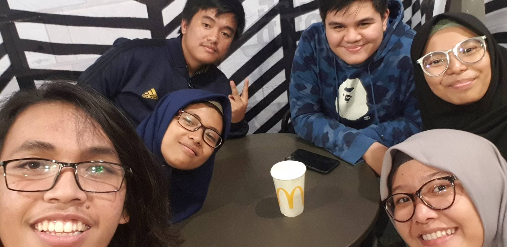

# Wawancara Kak Ardji

Pada hari Kamis, 22 Agustus 2019 pukul 21:00 di MCD Dago saya (Yuni), Ferdina, Shofu, Olop, dan Daniel melakukan wawancara dengan salah satu Daemon yaitu Kak Ardji.

# Biodata Kak Ardji

Nama lengkapnya Ardji Naufal Setiawan (18216021), panggilannya Ardji. Dia jurusan Sistem dan Teknologi Informasi angkatan 2016. Di HMIF ITB dia Ketua Tim Riset. Alasan Kak Ardji memilih pengmas adalah dapat menumbuhkan empati sesuai dengan apa yang ingin diwujudkan oleh Kak Abay. Prokernya ada pengmas keliling, literasi dan peliputan, pengmas berdiskusi, dan HMIF Peduli. Output utama dari projek pengmas adalah rekomendasi sistem kerja mempertimbangkan sebenarnya riset membutuhkan waktu yang sangat lama sehingga dapat memperoleh data yang valid. Kalau di Arkavidia Kak Ardji gawenya di logistik karena sejak dari SMA dia emang udah sering kerja di logistik dan kayaknya dia bisa memaksimalkan diri di divisi ini.

# Pertanyaan Bebas

Yuni :

Hal yang paling beruntung ketika Kak Ardji masuk ke HMIF adalah bisa menghabiskan waktu dengan orang-orangnya yang membuat Kak Ardji sayang sama orang dan organisasinya. Momen paling berkesan menurut Kak Ardji selama dia di HMIF adalah saat dia mengajar di panti. Ketika turun ke lapangan langsung, sudut pandang kita itu bisa berubah katanya. Dan juga, ketika bisa membuat bahagia orang lain dapat memberikan kepuasan tersendiri bagi kita yang memberikan.

Berhubung Kak Ardji udah tiga tahun di ITB mungkin pernah mengalami kejadian mistis. Syukurnya Kak Ardji ga pernah nemuin hal-hal berbau mistis di ITB. Tapi waktu itu dia pernah ngajakin adeknya yang bisa 'liat' jalan-jalan di sekitaran sipil terus adeknya liat sesuatu yang pastinya bukan manusia mondar-mandir. Ya, itu mistis buat adeknya si bukan dari Kak Ardji sendiri.

> Note: Cerita paling berkesan yang disampaikan oleh Kak Ardji selama wawancara adalah Unicorn yang kita liat dengan mata kepala saat ini adalah yang membantu masyarakat tetapi jika kita bisa melihat lebih jauh lagi ada pihak luar yang jauh lebih diuntungkan daripada masyarakat sebagai penggunanya.

Ferdina :

Nanti kerjanya mau bagaimana?
Kak Ardjie ingin kerja yang impactful, cari perusahaan yang seperti itu. Kak Ardjie belum mau bikin startup karena basicnya belum punya walaupun kata orang bisa sambal jalan. Kak Ardjie ada planning kecil untuk masuk organisasi atau perusahaan yang terjun langsung ke masyarakat. Kaka Ardjie ingin menjadi analis, survey dulu buat desain sistem lalu desainnya juga dari masyarakat. Kak Ardjie magang di Ruang Guru sebagai business analyst, kerjaannya banyak katanya, salah satunya data analyst dan product manager. Di Ruang Guru approach anak-anak langsung jadi kerjanya terjun ke masyarakat langsung. Kata kak Ardjie lingkungan kerja sama perkuliahan itu berbeda.

Ikut unit apa saja?
Kak Ardjie ikut tiga unit, yaitu UKJ, ATLAS, dan Majalah Ganesha. Ikut UKJ karena temannya banyak disana, kak Ardjie suka sejarah, sejarah Jepang menarik menurutnya. Kak Ardjie ikut ATLAS tapi badannya ga atletis katanya hehe. Majalah Ganesha itu lebih ke masalah-masalah di masyarakat, isu-isu jalanan, beda sama Tiben. Kalo Tiben lebih filosofis, bisa bahas satu kata dalam waktu satu atau dua jam. Awalnya pernah ikutan TEC, sempat bikin usaha, nyikat sepatu sampai malam. Tapi didiagnosa usus buntu jadi kata orang tua disuruh berhenti.

> Note: kak Ardji orangnya sangat peduli dengan masyarakat. Kata kak Ardjie kalo udah berbagi / berbuat baik ke sesama ada rasa puas (bahagia) tersendiri

Shofu :

Ka Ardjie ini banyak ngikutin pengmas-pengmas gitu, apalagi sekarang Ka Ardjie juga udah tergabung dalam divisi Pengmas kan. Menurut Ka Ardjie, semua pengalamannya itu beda-beda dan punya kesan masing-masing. Dalam bidang yang berbeda, di desa yang berbeda, dengan masyarakat yang juga berbeda-beda gitu. Dan hal yang  Ka Ardjie suka saat melakukan pengabdian masyarakat salah satunya adalah saat dia dapat mengajari anak-anak dan punya pengalaman ngehadapin anak-anak yang sifatnya berbeda-beda.

Sebagai seorang mahasiswa Ka Ardjie juga memiliki hal yang bias menjadi spesialisasinya. Waktu magang untuk KP yang lalu, Ka Ardjie mengambil bidang Business Analyst, dan dari pengalamannya Ka Ardjie, katanya ternyata sewaktu proses ngga tentang business analyst saja, tetapi banyak hal lainnya. Dan sewaktu ditanya, Ka Ardjie mau mendalami bidang apa, ternyata Ka Ardjie emang lagi mendalami bidang business analyst tersebut.

Olop :

Kakak magang nya dimana?
Selama liburan semester 6, kak Ardjie mengikuti magang di Ruang Guru. Kak Ardjie mendapat di bidang Bussiness Analysist. Disana kak Ardjie juga terkejut bahwa ada anak dari fakultas selain STEI yang ngambil magang di Ruang Guru, yang tidak sesuai dengan bidangnyadi kuliah.

Passion masuk ITB apa kak?
Sebenarnya semenjak SMP, kak Ardjie bercita-cita untuk menjadi seorang engineer. Sehingga kak Ardjie memutuskan untuk SMA di Bandung karna dari SMA ini sangat banyak masuk ke ITB. Sewaktu menjalani masa TPB, kak Ardjie pengennya masuk jurusan Biomedis. Tetapi setelah berbincang - bincang dengan salah satu dosen Biomedis, kak Ardjie memikirkan ulang jurusan apa yang dipilihnya, karena jurusan Biomedis kurang diminati di Indonesia. Akhirnya kakaknya memilih jurusan STI.

Daniel :

Pelajaran yang paling kakak sukai waktu kuliah apa dan mengapa ?
Pelajaran atau mata kuliah yang disukai Kak Ardjie adalah Statistika karena kesimpulan dari hasil analisis Kak Ardjie terhadap data - data yang disediakan dapat berbeda dengan kesimpulan berdasarkan hasil perhitungan dengan rumus - rumus yang ada. Hal ini yang membuat Kak Ardjie tertarik dengan pelajaran ini dan ingin mempelajarinya lebih dalam.

Apakah kakak daftar panitia Arkavidia dan menjadi bidang apa ? Dan mengapa mengambil bidang tersebut ?
Kak Ardjie daftar dalam panitia Arkavidia sebagai paniti bidang Logistik. Kak Ardjie mengambil bidang Logistik karena dari SMA kak Ardjie sudah tertarik dengan bidang logistik dan setiap ada event atau acara yang membutuhkan panitia, sebagian besarnya kak Ardjie mendaftar sebagai panitia Logistik sehingga Kak Ardjie sudah mengetahui semua seluk beluk dalam bidang Logistik.

