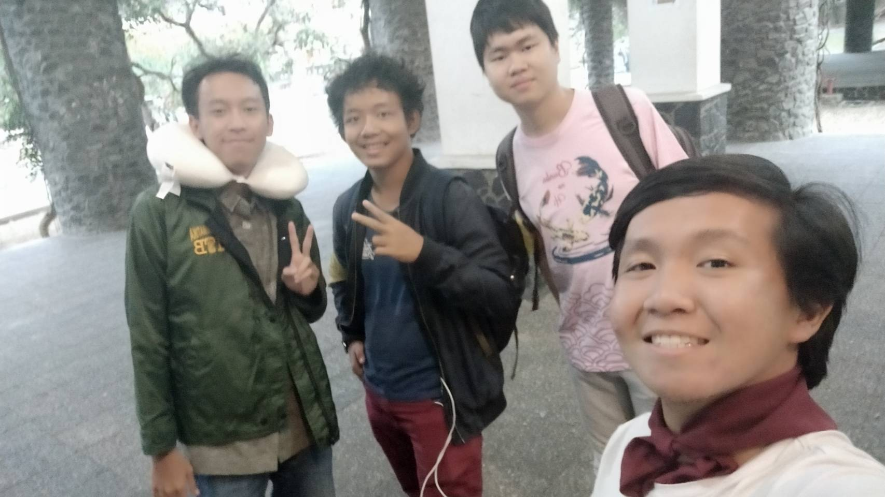

# Wawancara Stegano

Selasar TU STEI Labtek V Lt. 2 jam 07.00 hari Rabu, 21 Agustus 2019

Pada saat itu, kami:

16518245 - Faris Rizki Ekananda

16518048 - Filbert Wijaya

16518346 - Ananda Yulizar

mewawancarai kak Tio yang memiliki *codename* Stegano.

## Pengenalan

  Kak Prahasto Satrio Utomo, atau biasa dipanggil dengan kak Tio, merupakan seseorang dengan NIM 18216026 alias mahasiswa Sistem dan Teknologi Informasi angkatan 2016. Kak Tio merupakan kadiv kekeluargaan HMIF ITB saat ini. Di sana ia memiliki mimpi untuk membuat HMIF menjadi tempat yang senyaman mungkin dengan proker-proker dari divisi kekeluargaan yang dapat dibilang untuk melepas penat. Karena ia percaya bahwa himpunan adalah tempat untuk kita semua bisa berkumpul bersama-sama.
 
  Berhubung tadi menyinggung proker, dalam divisi kekeluargaan yang dinaunginya ada 5 proker yang ia ceritakan kepada kami. Yang pertama adalah Ulang Tahun, yaitu tiap ada anggota HMIF yang berulang tahun, divisi kekelurgaan akan 'merayakannya' di HMIF melalui pemberitahuan di Line. Yang kedua adalah Rehat, yaitu merencanakan dan mengajak anggota HMIF untuk jalan-jalan dan main bareng, mungkin nonton bioskop dan sebagainya. Berikutnya adalah wisuda yang merupakan pelepasan kakak-kakak HMIF kita yang telah menyelesaikan pendidikannya dan akan segera lulus. Lalu, Hari Nasional, yaitu mengucapkan hari nasional pada hari itu dan mungkin mengadakan acara kecil seperti bertukar kado atau coklat. Yang terakhir, adalah Buka Bersama yang dilaksanakan pada bulan Ramadhan saat teman-teman yang beragama islam berpuasa untuk meningkatkan tali silaturahmi kita.
  
## Pertanyaan Bebas

  Dengan melihat kepribadian dari kak Tio, saya penasaran dan bertanya kepadanya apakah ada suatu keputusan yang ia buat dalam hidupnya yang dapat dibilang benar-benar membentuk hidupnya yang jika ia tidak lakukan di waktu itu maka hidupnya sekarang akan benar-benar berbeda. Katanya, momen tersebut adalah saat ia menyalonkan diri menjadi ketua SPARTA. Walaupun ia tidak mendapatkan posisi tersebut, ia berkata bahwa ia benar-benar berkembang di sana secara pribadi, lalu dari sana ia melanjutkan menjadi kadiv logistik dar Arkavidia dan akhirnya semua itu membawanya menjadi kadiv kekeluargaan yang sekarang ia naungi di mana ia dapat mewujudkan mimpinya untuk HMIF.
  
 Kak Tio juga berkata bahwa ia sempat berkecimpung di tim kesenatoran HMIF ITB sebelum ia bernaung di divisi kekeluargaan. Namun, saat saya tanyakan mengenai pengalamannya di tim kesenatoran, ia berkata bahwa ia kurang aktif di sana karena ia merasa bahwa ia kurang cocok di tim kesenatoran. Awalnya, ia bercerita bahwa ia masuk ke tim kesenatoran karena 'arogansi lapangan', di mana sebelumnya ia merupakan salah satu Medik OSKM ITB dan ia merasa bahwa sebagai salah satu panitia lapangan ia harus mendekat ke pusat, alhasil ia memilih tim kesenatoran untuk mewujudkan itu. Namun, ternyata ia merasa kurang cocok di situ walaupun dia sudah 2 tahun di dalam tim kesenatoran. 
 
 Terdapat banyak permasalahan yang harus dibenahi divisi kekeluargaan, banyak tuntutannya. Divisi kekeluargaan harus dapat merangkul semua anggota HMIF baik IF, STI, angkatan atas ataupun angkatan bawah. Karena pengaruh kelas yang itu-itu aja, kelompok bermain dan mengerjakan tugas yang itu-itu aja, anggota HMIF dirasa mulai renggang karena terciptanya kelompok-kelompok sendiri yang memang dari perkuliahannya akan menjadi lumayan jarang ketemu dengan kelompok lainnya karena kelas ataupun matkul yang tidak berkaitan. Cara bersenang-senang tiap orang juga tidaklah sama sehingga kalau mau buat acara yg bener-bener bisa dinikmatin oleh semua orang itu susah. Maka dari itu, strategi yang digunakan Kak Tio adalah dengan cara menyatukan beberapa circle-circle kecil terlebih dahulu yang memiliki minat yang sama sehingga lama kelamaan circle yang menyatu semakin besar dan dapat merangkul semuanya.
 
  Selama wawancara, kak Tio sangat membawakan suasana yang santai. Sebelum wawancara, ia bahkan meminta kami untuk membawa makanan yang dapat dimakan bersama-sama saat wawancara. Ia pun sesekali mencoba untuk mencairkan suasana dengan beberapa *jokes*. Bahkan, sejujurnya kami lupa untuk berfoto dengan kak Tio pada saat pertemuan wawancara dan kami meminta untuk berfoto di hari lain di luar waktu perjanjian kami dengannya dan ia menyanggupinya walaupun bisa dibilang hal tersebut cukup merepotkannya.
