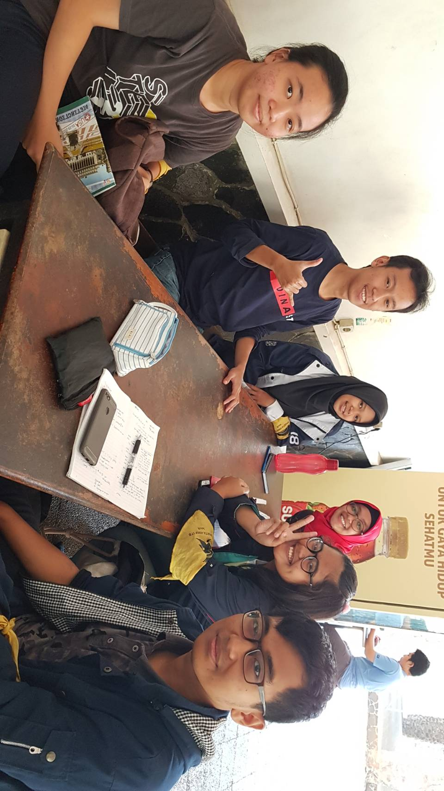

# Kak Prahasto Satrio Utomo a.k.a. stegano
Minggu, 25 Agustus 2019(09.00-11.00)
Tempat: Selasar Labtek V

- 16518065 - Naomi Yolanda
- 16518128 - Elisabeth Levana
- 16518181 - Alya Mizani
- 16518242 - Naufal Prima Yoriko
- 16518348 - Sulis Tiana

# Tentang Kak Tio
Nama lengkapnya Prahasto Satrio Utomo dan lebih akrab dipanngil Kak Tio. Ia berasal dari Bandung. Saat ini Kak Tio merupakan mahasiswa jurusan Sistem dan Teknologi Informasi, alasan kak Tio mengambil jurusan ini karena ia merasa di STI ada banyak waktu untuk eksplorasi diri, orang-orangnya santai, ga banyak tugas serta Kak Tio sendiri adalah tipe orang yang suka teknis tapi gasuka teknis yang mendalam banget seperti di IF.

## Peran di HMIF
Kak Tio saat ini merupakan kadiv kekeluargaan yang ada di departemen internal. Kak Tio bercerita ia mendaftar sendiri untuk memperoleh jabatan tersebut. Kak Tio ingin menjadi kadiv kekeluargaan karena merasa ingin menyebarkan kesenangan bagi orang-orang. Kak Tio pun pernah menjadi kadiv logistik di arkavidia, karena pernah berkomitmen demikian saat masuk HMIF, dan logistik adalah divisi yang menurut kak Tio visible untuk dikerjakan. Beberapa proker yang ada di divisi kekeluargaan ialah, ucapan selamat ulang tahun di grup angkatan, apresiasi hari besar nasional, wisuda, rehat(random event), dan juga buka bersama.

# Pertanyaan Bebas

Enaknya perkuliahan di STI menurut Kak Tio adalah lingkup pertemanan yang saling mendukung untuk berkembang. Teman-teman di STI tidak akan pernah meninggalkan dirimu. Tetapi, sayangnya mahasiswa STI hobi nge-skip tugas, apalagi yang ngoding. Cara menghadapi orang-orang yang menghilang di saat tersebut menurut Kak Tio adalah confront mereka. Sadarkan mereka akan tanggung jawab mereka dan jangan takut akan rusaknya pertemanan karena hal-hal yang sudah disampaikan adalah untuk kebaikannya.

Kak Tio adalah tipe orang yang santai ketika akan menghadapi ujian. Meskipun besok akan UTS, kak Tio bisa karaokean satu hari sebelum ujian, bersama temannya, sehingga pikiran menjadi lebih relax untuk mengikuti ujian keesokan harinya. Untuk urusan belajar, Kak Tio sudah tidak terlalu pusing memikirkannya karena sudah belajar dari jauh-jauh hari.

HMIF yang sekarang menurut Kak Tio sudah lebih terbuka. Selain itu, program-program kerja yang diemban HMIF juga sudah sesuai dengan kebutuhan HMIF sendiri. Tidak seperti dulu di mana orang-orang tidak menitikberatkan kepentingan dan kebutuhan HMIF dan malah menomorsatukan kepentingan diri sendiri. Sekarang, semua program kerja sudah berangkat dari kebutuhan HMIF.

Sebelum menjadi kadiv kekeluargaan, kak Tio berada di kesenatoran. Awal Kak Tio memilih kesenatoran karena merasa ingin masuk ke terpusat. Namun setelah dijalani, ternyata Kak Tio sadar itu bukanlah passionnya. Karena itu akhirnya di kepengurusan berikutnya kak Tio memilih menjadi kadiv kekeluargaan.

Berbicara tentang eksplorasi diri, kak Tio bercerita bahwa ajang untuk eksplorasi diri baginya tidak selalu harus formal seperti akademik ataupun karir. Namun juga hal-hal seperti travelling merupakan bentuk eksplorasi diri. Untuk saat ini hasil eksplorasi diri kak Tio terhadap minat dalam karir jatuh kepada Data Analyst dan juga Internet of Things.

Selain itu eksplorasi yang juga sering dilakukan kak Tio yaitu dengan main bareng teman, eksplorasi keliling Bandung dan eksplorasi karir-karir untuk anak STI. Kegiatan apa saja yang kita lakukan selama berguna untuk menambah wawasan/soft skill/hard skill merupakan kategori eksplorasi bagi kak Tio.

Menurut kak Tio, tentang gap antar angkatan di HMIF itu bergantung pada tiap orang. Kak Tio sendiri merasa akrab dan berbaur, bahkan dengan angkatan'14, sampai-sampai ada angkatan 14 yang akhirnya berpendapat negatif tentang dia (ga sopan, dsb). Tapi secara umum pasti ada, namun terkadang dari adik tingkat bisa saja yang memberi gap, tidak mesti kating. Namun dengan ada nya sparta tahun ini dinilai bakal bisa lebih mempererat antar angkatan.

Acara kekeluargaan HMIF yang dibawahi kak Tio walau sudah berusaha memberi ruang untuk dapat merekatkan hubungan, namun tetap saja belum bisa menyatukan semuanya. Seperti acara nobar avenger hanya dihadiri sekitar 20an orang saja, namun hal ini dapat dimaklumi kak Tio karena tiap orang memiliki prioritas atau preferensinya masing-masing. 

Yang selama ini Kak Tio dapatkan di HMIF, adalah kesenangan, menambah pertemanan, kak Tio itu suka hal-hal yang fun. Sering juga nonton bareng temen himpunan. tapi kalau dilihat dari sisi materi kak Tio merasa itu rugi.

Setelah lulus dari STI ITB, rencananya kak Tio mau bekerja, kak Tio tertarik sama Data Science, ya kerjanya di ranah Data Scientific. Kerja terus ngumpulin uang buat beli rumah di Bandung, Walau dibesarkan di Bandung, kak Tio masih tetap berkunjung ke Jawa Timur. Rencananya pengen pindah dan beli rumah aja di Bandung. Setelah itu, kak Tio menikah.

# Kesan
Wawancara sama kak Tio itu butuh waktu yang lama, tapi rasanya jadi kayak wawancara dua arah karena kami juga dapat beberapa kesempatan menyampaikan pendapat ataupun diberi pertanyaan. Wawancara yang dua jam kemarin jadi tidak terasa karna topik yang dibahas cukup banyak dan tidak monoton. Dari Kak Tio dapat dipelajari perihal komitmen dan juga kerja keras. Ia mampu menepati janjinya menjadi kadiv logistik di arkavidia, selain itu mau bekerja keras demi menjalankan proker divisi kekeluargaan.

# Foto

