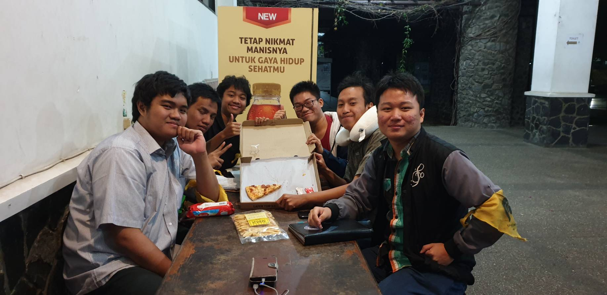

# Foto

# Summary

>Wah ada pizza, anj*r!
>
>**~Prahasto Satrio Utomo**

Pada hari Jumat, 23 Agustus 2019 jam 7 malam, kami mewawancarai kak Tio yang nama lengkapnya Prahasto Satrio Utomo. Jurusannya adalah Sistem dan Teknologi Informasi. Mengambil peran di Dewan eksekutif HMIF dalam divisi Internal sebagai ketua bidang kekeluargaan. Selain itu kak Tio juga mengambil peran sebagai Komandan Lapangan di SPARTA HMIF 2017, serta kadiv logistik di Arkavidia 5.
Alasan mengambil peran tersebut karena HMIF sudah tercap apatis dan tidak solid dengan stereotype dari luar himpunan maupun dar i anggota-anggota himpunannya itu sendiri, tetapi kak Tio merasa ingin mengubah cara pandang tersebut. dengan mengubah mindset itu kak Tio pun yakin keberjalanan kegiatan berorganisasi di HMIF pasti dapat berjalan dengan lancar. Mindset yang ingin ditekankan oleh kak Tio adalah dengan membuat orang berpikir bahwa kegiatan berorganisasi itu bukanlah suatu hal yang melelahkan namun dapat menjadi suatu hal yang menyenangkan dan juga melepas kepenatan.

PROGRAM KERJA =
1. Ucapan Ulang Tahun anggota HMIF
2. National Day bersama
3. Rehat (RANDOM EVENT)
4. Buka Puasa Bersama
[LANJUTIN YA]

### Kenapa milih STI daripada jurusan lain?
Sebenarnya kak Tio ini lumayan jago ngoding, dia bisa masuk IF. Tapi, alasan kak Tio untuk memilih jurusan STI adalah karena dia ingin mencari yang lebih luas. Dia belum tahu letak passionnya dimana. Dia ingin mencari exposure seluas-luasnya. Dia merasa bahwa STI dapat memberikan exposure yang dia inginkan. Akhirnya dia memilih STI.

### Bagaimana cara mengatasi rasa canggung ketika mau masuk sekre?
Menurut kak Tio, rasa canggung saat pertama kali masuk sekre (abis lantik) itu normal. Saran dari kak Tio adalah: Jangan dateng sendiri kalo ngerasa ga enak, dateng aja rame-rame. Terus, berhubung kating banyak yang kelas pagi, dateng aja duluan ke sekre. Kuasain sekrenya dulu. Take your time untuk pembiasaan, tapi yang jangan terlalu lama.

### Pengalaman Kak Tio saat KP
Untuk KP, Kak Tio mendapatkan kesempatan untuk magang di perusahaan Johnson & Johnson, yang lebih dikenal di Indonesia sebagai produsen bedak bayi. Tapi ternyata, J&J juga bergerak di bidang lain, lho, seperti peralatan medis, produk kemasan, dan farmasi, salah satunya adalah obat kumur Listerine. Nah, di perusahaan ini, Kak Tio mendapatkan tugas sebagai data analyst untuk bagian pemasaran. Pada awalnya, Kak Tio merasa kurang begitu cocok dengan pergaulan di kantornya di Jakarta. Tapi kemudian ia bertemu dengan mentor yang asyik dan mengajarkannya banyak hal.

### Unek-unek kakak kepada massa HMIF, terutama saat menjalankan tugas sebagai kabid kekeluargaan
Kak Tio merasa bahwa massa HMIF masih cenderung individualis, kurang peduli kepada sekelilingnya. Padahal, lingkungan tersebut sangat berpengaruh ke kehidupan para anak-anak IF-STI saat perkuliahannya. Oleh karena itu, kak Tio merasa berkewajiban untuk menyediakan sebuah wadah untuk sebagai sarana penghubung antara lingkungan dengan HMIF itu sendiri, lewat metode-metode kekeluargaan. Contohnya pada bukber HMIF, bidang kekeluargaan mengajak satpam labtek V untuk ikut, lalu menyapa orang-orang di dapur sehingga hubungan mereka dengan HMIF makin baik dan erat.

### Cerita serem kak Tio
Waktu itu kak Tio sedang melakukan makrab di Villa Istana Bunga, Lembang. Lalu di suatu malam, sebuah saung yang bawahnya gelap dan dingin kak Tio melihat makhluk seram yang sampe sekarang keinget terus. Dulu waktu kecil kak Tio juga katanya pernah serasa 'diangkat' terus dijatohin sama 'sesuatu'. Tapi in general, kak Tio belum ada pengalaman serem di ITB. 

### Kesan SPARTA menurut Kak Tio
waktu itu kak Tio ikut panlap sehingga dia banyak melewatkan hal-hal yang menjadi esensi di dalam SPARTA, dia sangat menyesali hal itu dan dia juga dulu jarang ke basecamp pada zamannya. Namun semuanya dia tebus pada saat masuk ke dalam HMIF dan menjadi aktif sampai sekarang menjadi ketua bidang kekeluargaan di Divisi Internal.

### Pandangan dan Kesan Kak Tio, yang berasal dari Bandung, terhadap perilaku orang Jakarta
Dari segi budaya, kalau di Bandung, ketika kita berkata "Punten" biasanya kita akan dibalas "Mangga" dengan senyuman. Ketika Kak Tio magang di Jakarta, saat bilang "Misi" ke seseorang mereka malah menjawab "Apa sih lu?", meski tidak semuanya begitu. Di HMIF sendiri banyak yang dari Jakarta sehingga kak Tio terbiasa pakai "Lu/Gua" dan menurut kak Tio itu biasa aja dan tidak tidak sopan. Tapi menurut kak Tio orang Bandung lebih terasa jiwa sosialnya.

### Mimpi Kak Tio ketika ia SPARTA
Pada saat SPARTA, jika ditanyakan mengenai mimpi dan komitmen, kak Tio menjawab dia ingin menjadi Kadiv Logistik Arkavidia. Mimpi itu berhasil terwujud, namun bukan berarti kak Tio sudah selesai di HMIF. Kak Tio mulai mencari mimpi baru lagi, ditemukanlah keresahan kak Tio mengenai HMIF yang sudah kurang bonding-bonding lagi sehingga membuat kak Tio ingin menjadi Ketua Kekeluargaan. 

### Momen palling mebahagiakan bagi Kak Tio di HMIF
Bagi kak Tio, ia memiliki sesuatu yang berharga di HMIF, yaitu kenangan yang sangat membahagiakan ketik makrab BIT. Meskipun yang datang 70 orang, namun kak Tio dapat mengekspresikan perasaan pribadinya dengan baik, mulai dari teriak-teriak ga jelas sampai nyanyi bareng dengan angkatan. Bagi kak Tio, hal itu merupakan momen yang berharga di HMIF itu sendiri.

### Ekspetasi masuk ITB dan HMIF secara khusus
Kak Tio sendiri masuk ITB karena menurutnya ITB itu sudah memiliki reutasi yang sangat bagus, terlebih lagi kak Tio tinggal di Bandung. Harapan kak Tio ketika masuk ITB adalah hal-hal yang diharapkan orang pada umumnya seperti masuk kuliah, mendapat IP yang bagus, aktif di UKM dan HMJ, dan sebagainya. Namun ketika sudah merasakan hal tersebut semuanya hampir menjadi hal yang sulit untuk dicapai.

Pada saat sebelum masuk himpunan sendiri, kak Tio masih bingung dengan esensinya ikut kegiatan pengaderan itu sendiri. Selain itu kak Tio saat itu sedang sibuk di panitia lapangan sehingga kurang aktif di kaderisasi. Namun setelah kegiatan panitia lapangan berakhir, kak Tio berusaha untuk bonding dengan angkatan dan hal itu membuat kak Tio merasa menyesal karena tidak mencoba meluangkan waktu untuk angkatan ketika mengikuti panitia lapangan sehingga hal itu berdampak setiap topik yang berada di angkatan menjadi kurang dimengerti oleh kak Tio sendiri. Namun hal tersebut dapat diatasi dengan sifat kak Tio sendiri yang mudah bergaul.

# Kesan tentang kak Tio
Menurut kami kak Tio itu orangnya cukup talkative tapi peduli dengan orang lain dan lucu. Hal ini membuat kami mudah memulai percakapan dngan kak Tio dan tidak ada suasana canggung daintara kami semua.
