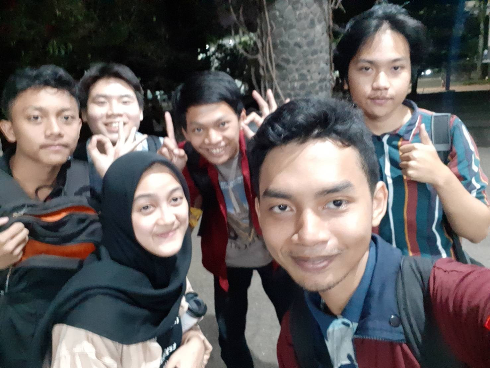

Tugas Wawancara Daemon  
Nama    : Mira Risty Masyita  
NIM     : 18216037  
Tanggal : 23 Agustus 2019  
Tempat  : Selasar Labtek VIII ITB  

&nbsp;&nbsp;&nbsp;&nbsp;&nbsp;&nbsp;Pada Hari Jum'at, tanggal 23 Agustus 2019, kami berlima bertemu dan melakukan wawancara dengan Kak **Mira Risty Syinta** yang biasa dipanggil Kak **Cita**. Kakak ini seorang mahasiswi dari jurusan Sistem dan Teknologi Informasi atau yang biasa disingkat STI dan berasal dari angkatan 2016. Di HMIF, Kak Cita berperan sebagai staff di divisi *Culture Development* dengan perkejaan seperti menyusun lapor anggota dan merumuskan konsep dari implementasi budaya di HMIF. Divisi yang ditekuni kakak ini dulunya PSDA dan saat ini telah menjadi People and Culture, Kak Cita lebih memilih Culture karena kurangnya orang di divisi tersebut.

&nbsp;&nbsp;&nbsp;&nbsp;&nbsp;&nbsp;Tahun ini, Kak Cita berkesempatan menjadi ketua rangkaian acara **Arkavidia 6.0.** Ketertarikannya untuk menjadi penanggung jawab atau *The Last Man Standing* ini disebabkan kakak adanya latar belakang yang kuat untuk memberhasilkan terselenggaranya acara ini dan tersampaikan pula pesan untuk tercapainya solusi dari latar belakang masalah yang ada. Latar belakang yang sangat digarisbawahi adalah bagaimana adanya kesenjangan-kesenjangan yang diakibatkan oleh digitalisasi dan terutama pada era **Revolusi 4.0** sekarang.

&nbsp;&nbsp;&nbsp;&nbsp;&nbsp;&nbsp; Kak Cita sempat berbagi alasannya dalam memilih masalah tersebut sebagai latar belakang untuk Arkavidia 6.0. Alasannya karena sudah sangat sering terlihat fenomena-fenomena di Indonesia dalam pemakaian teknologi yang tidak optimal. Bebera contohnya dijabarkan oleh Kak Cita, seperti pengguna **Tik Tok** di Indonesia memiliki konten yang tidak kompeten atau sekreatif pengguna **Tik Tok** di luar negri dan juga seperti kasus [KitaBisa](https://kitabisa.com) yang awalnya ingin dipakai sebagai kickstarter atau modal awal para inovator muda akhirnya dipakai sebagai gerakan-gerakan sosial.

&nbsp;&nbsp;&nbsp;&nbsp;&nbsp;&nbsp; Saat itu, kami menyakan pengalaman-pengalaman Kak Cita tentang kaum Adam yang mungkin cukup sering nge-pkdt-in atau mendekatinya. Kakak pun membagikan sepotong kisahnya saat menjadi medik dan perangkat dulu. Di masa itu, Kak Cita lagi deket dengan beberapa orang dan ada 5-6 orang yang dirasa Kak Cita sedang mencoba mengambil hatinya. Kak Cita lebih senang mendekati yang terlihat cuek dan berwibawa karena terlihat sangat dewasa, tetapi pada akhirnya Kak Cita menyesal. Beberapa orang yang didekatinya pun ada yang kecewa hingga menanyakan kepastiannya langsung pada Kak Cita.

&nbsp;&nbsp;&nbsp;&nbsp;&nbsp;&nbsp;Tidak hanya itu, kami juga bertanya tentang pengalaman keprofesian kak Mira. Kata kak Mira ia baru mulai menemukan cita-citanya di bidang keprofesian di awal tahun kedua, sama seperti kami sekarang. Kami pun bertanya bagaimana caranya untuk mengejar ketertinggalan kita. Kata Kak Mira, kita harus mengejar hal - hal yang kita suka. Selain itu, meminta teman - teman yang sudah mahir dalam bidang tersebut juga sangat membantu, karena belajar dari teman sendiri lebih enak.

&nbsp;&nbsp;&nbsp;&nbsp;&nbsp;&nbsp;Kami juga bertanya tentang pengalaman di Sparta kak Mira dulu. Kata Kak Mira, dulu dia sering banget interupsi, jadi jarang dikasi gitu. Lalu pada saat sedang pelantikan, sekitaran jam 7 kurang 15an, kak Mira mendengar secara samar suara adzan. Karena itu kak Mira berteriak dan menanyakan hal tersebut. Ternyata memang benar, dan prosesi pelantikan pun dihentikan sementara, sehingga suasananya cukup aneh ketika pelantikan dilanjutkan setelah adzan.
