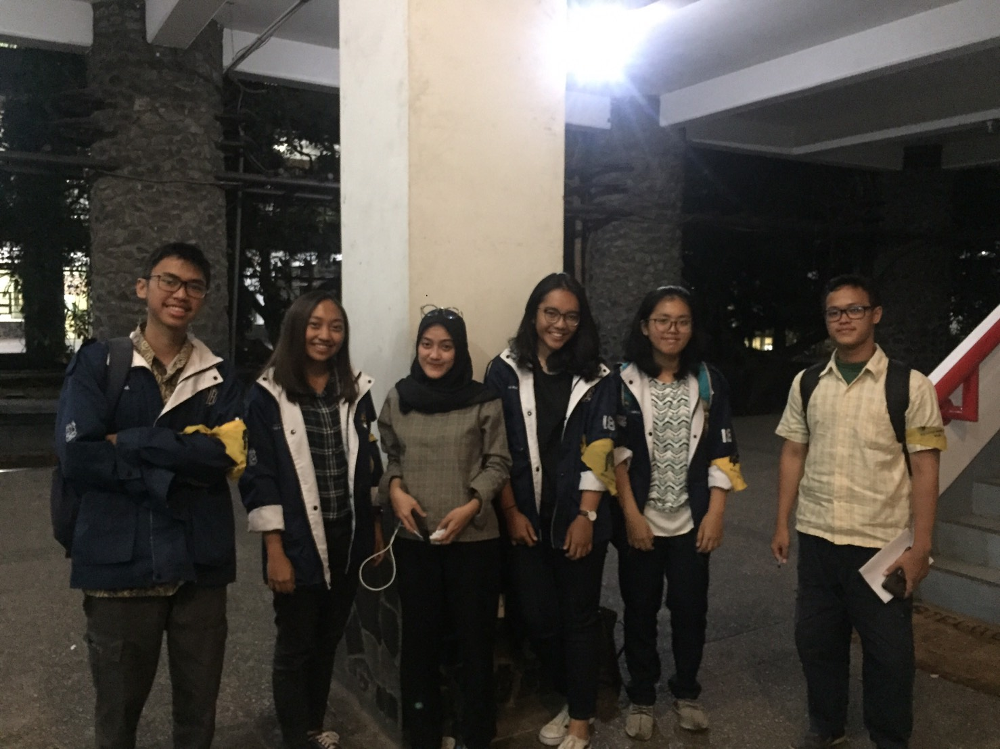

# Wawancara dengan Kak Mira Risty Mashira

Pada hari Senin, 26 Agustus 2019 pukul 17:00 kami pewawancara :
1. 16518012 - Muhammad Hasan
2. 16518021 - Raras Pradnya P.
3. 16518159 - Cynthia Athena Mahadewi S. 
4. 16518304 - Tifany Angelia
5. 16518405 - Hizbulloh Ash-Shidiqy

mewawancarai Kak Mira Risty Masyita di selasar Labtek 5. 

# Summary
Kak Mira Risty Masyita atau yang kerap dipanggil Cita adalah mahasiswi Sistem dan Teknologi Informasi 2016. Kak Cita memiliki
ketertarikan dengan bidang videography. Beliau memiliki cita-cita menjadi Business Intelligence serta memiliki organisasi
berbasis sosial bidang lingkungan. Saat ini, Kak Cita menjabat menjadi Ketua Arkavidia 6.0. 

## Mengapa ingin menjadi Ketua Arkavidia 6.0?
Kak Cita melihat fenomena transformasi digital yang berkembang sangat pesat dewasa ini. Namun, muncul keresahan bahwa 
masyarakat Indonesia belum dapat mengejar perubahan ini dan semakin hari semakin tertinggal. Kak Cita melakukan riset dan 
menemukan bahwa hampir seluruh paper tentang transformasi digital ditulis mengarah ke bidang bisnis. Jarang sekali ada yang 
membahas aspek kemasyarakatannya. Kak Cita berharap dengan adanya Arkavidia ini dapat membawa dampak baik bagi masyarakat
untuk meningkatkan awareness.

## Apa saja jobdesc Ketua Arkavidia?
Ketua Arkavidia bertugas mengoordinasikan dan mengontrol setiap kabid maupun kadiv. Selain itu, harus bisa tetap menjaga
nilai-nilai yang ada atau yang akan dibagikan sehingga tujuan awalnya bisa tercapai. Terakhir, menjadi ketua arkavidia artinya
menjadi last 'woman' standing. 

## Bagaimana perjalanan menuju mimpi yang diidamkan sekarang?
Sejak muda, Kak Cita merupakan orang yang cenderung 'let it flow' aja. Kak Cita masuk STEI tanpa tahu alasannya kenapa, masuk
jurusan STI sesimpel tidak menyukai koding dan kelistrik-listrikan dan lebih menyukai bisnis. Pengalaman pertama yang membentuk
mimipi Kak Cita sekarang adalah saat menjadi Panitia OSKM 2017 divisi Medik dan masuk sekolah perangkat. Disana, Kak Cita belajar
bahwa hidup tidak bisa selamanya gini-gini aja, ia harus memiliki visi hidup agar hidupnya lebih bermakna. Setelah itu, Kak Cita
juga berpengalaman menjadi pendiklat di medik dan di SPARTA. Kak Cita merasa bahwa justru kegiatan-kegitan yang jauh dari
akademik yang membentuk dirinya sekarang. Banyak pengalaman, baik gagal maupun berhasil akan menjadi pembelajaran yang berharga
untuk menjalani kehidupan yang sesungguhnya.

## Bagaimana dengan hobi videography-nya? Karya apa saja yang sudah dihasilkan?
Karena satu dan lain hal, Kak Cita tidak ikut unit LFM. Namun, Kak Cita menyalurkan hobinya ini dengan mendaftar menjadi
videographer di PPID ITB. Hobi Kak Cita ini dipelajarinya sendiri melalui tutorial-tutorial di YouTube. Hingga akhir-akhir ini, 
karena tuntutan pekerjaan, Kak Cita mempelajari Adobe After Effect agar skill nya semakin baik.

## Apa harapan nanti untuk Arkavadia 6.0 ?
Kak Cita berharap di Arkavidia 6.0 ini agar semua yang berpartisipasi didalamnya ikut menjalankan mimpi arkavidia, jadi tidak hanya ikut-ikutan begitu saja. Kak Cita berharap fenomena transformasi digital ini benar-benar bisa disebarkan ke masyarakat dan semua yang nanti berpartisipasi di Arkavidia 6.0 ikut membantu meningkatkan awareness terhadap hal tersebut.

## Apa yang pernah disesali ?
Kak Cita merasa dulu menyesal ketika saat SD gemar menari, namun kemudian berhenti ketika di SMP, hal ini karena Kak Cita dulu terpengaruh dengan lingkungannya saat itu yang menganggap bahwa tarian tradisional itu kuno, sehingga Kak Cita sendiri jadi merasa bahwa tarian itu kuno dan akhirnya ditinggalkan. Kak Cita juga menyesal kenapa dulu tidak fokus ke satu hal saja, dulu ia biasanya hanya mengikuti flow teman-temannya.

## Kesan pada Decrypt?
Kesan Kak Cita pada decrypt adalah kakak tau bagaimana cara menyampaikan dan mendidik decrypt, bagi kak Cita decrypt itu seperti adik sendiri. Waktu Kak Cita menyampaikan presentasi pada decrypt, seperti tidak ada penolakan, diterima-terima aja. Kurang kritis menurut Kak Cita. 

## Usaha yang kakak lakukan terhadap kepedulian lingkungan?
Kak Cita ini peduli banget sama lingkungan, kakak dikenal orang yang cerewet kalau masalah kebersihan.  Kakak juga sering mengingatkan teman-teman kakak untuk membuang sampah pada tempatnya. Jika kakak melihat sampah yang jatuh, kakak langsung mengambil dan membuang ke tempat sampah. Kak Cita ini orangnya tegas, waktu ada orang tidak dikenal sedang menanyakan letak gedung ITB ke Kak Cita, orang itu bertanya sambil membuang sampah sembarangan, lalu Kak Cita langsung melarang membuang sampah sembangan dan menyuruh orang itu membuang sampah pada tempatnya. 

