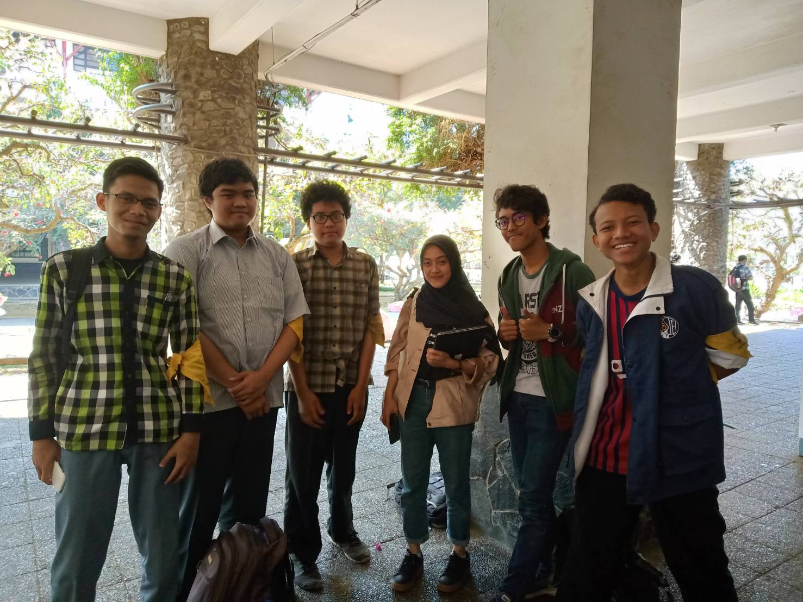

# Wawancara Daemon 'Bacon'

## Foto

## Summary
Pada hari Jumat, 23 Agustus 2019 jam 9 pagi, kami berkesempatan mewawancarai kak Cita. Nama lengkap kak Cita adalah Mira Risty Masyta. Jurusannya Sistem dan Teknologi Informasi. Mengambil peran di Arkavidia sebagai ketua Arkavidia. Alasan mengambil peran tersebut adalah [Insert alasan].

PROGRAM KERJA =
Mengkoordinasikan seluruh kabid dan kadiv, menjadi "the last man standing", dan menjaga nilai-nilai dari Arkavidia.

### Tempat makan paling enak di ITB menurut kak Cita
Menurut kak Cita, tempat makan paling enak adalah di Kantin Bengkok. Alasannya karena makanannya kayak makanan rumahan dan tempatnya yang bersih. Kak Cita sering kesana waktu TPB, tetapi waktu tingkat 2 sudah mulai jarang datang ke sana. Ketika tingkat 3 kak Cita mulai kangen dan mau makan disana lagi tapi ternyata Kantin Bengkok sudah tutup.

### Teknologi yang memudahkan manusia vs Kampanye perubahan mindset manusia
Misal ada teknologi yang membuat semua sampah yang manusia buang sembarangan bisa di transfer ke suatu tempat pembuangan sentral sehingga manusia tidak perlu susah susah cari tong sampah untuk membuang sampah, kak Cita tidak akan mendukung teknologi tersebut. Menurut kak Cita teknologi itu akan semakin merusak manusia. Lebih baik membuat mindset manusia menjadi lebih baik lewat kampanye kampanye dibanding membuat teknologi yang memudahkan namum memalaskan manusia.

### Usaha kak Cita dalam mengubah mindset orang-orang mengenai buang sampah
Menurut kak Cita susah mengubah mindset tersebut, namun tiap usaha dan hal-hal kecil itu sangatlah berarti. Contoh hal terkecil yang ingin diusahakan kak Cita adalah plastik. Kak Cita ingin kerjasama dengan Grab supaya tiap driver punya kit berupa tas khusus untuk GrabFood supaya dapat mengurangi penggunaan plastik.
