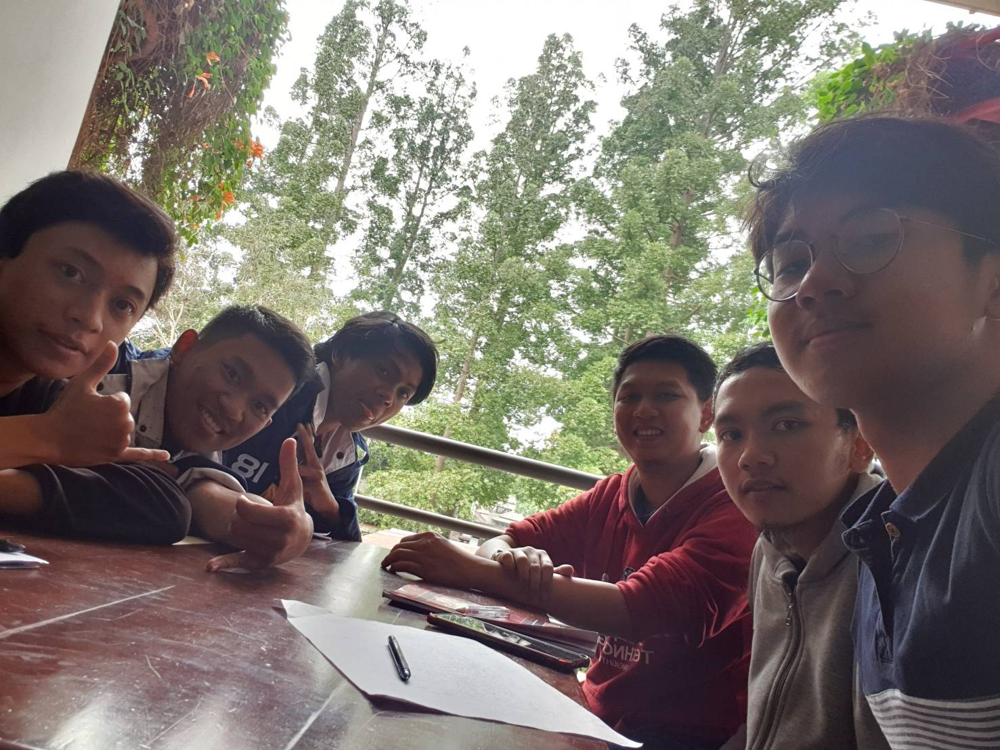

# Wawancara kak Sulthan

Pada hari Senin, 26 Agustus 2019 pukul 11.00, kami,
- 16518059 - Mohamad Falah Sutawindaya,
- 16518295 - INSERT_NAME,
- 16518376 - INSERT_NAME,
- 16518378 - Raihan Faturrahman,
- 16518386 - INSERT_NAME,

## Biodata
Daemon yang satu ini namanya kak Sulthan Mahdi Muhammad Dhiaulhaq, akrabnya dipanggil kak Sulthan. Dia ini dari jurusan STI jadinya
dulu dia ikut SPARTA deh buat masuk HMIF. Sekarang di HMIF, Kak Sulthan ini menjadi staff kekeluargaan karena dulu dia sempet jadi staff
Intrakampus terus dia pengan nyoba hal baru terus ada temennya bilang kalo kekeluargaan itu seru, jadinya dia memutuskan buat masuk ke
divisi kekeluargaan deh. Divisi kekeluargaan sendiri punya beberapa proker seperti Bukber, Nobar, dan ngucapin Ultah anggota HMIF. Selain Keorganisasian HMIF, Kak Sulthan juga aktif dalam Kepanitiaan acara yang diadain sama HMIF. Di salah satu proker eksternal terbesar HMIF yaitu Arkavidia, Kak Sulthan Menjabat sebagai Kepala BIdang Operasional. Hal tersebut didukung dengan pengalamannya pada tahun sebelumnya menjadi staff operasional khususnya pada bagian gala dinner.

Kak Sulthan berasal dari Sidoarjo (rumahnya aman dari lumpur lapindo). Di Bandung, dia kos di daerah Cisitu Indah. Makanan faforit di sekitar kos Kak Sulthan diantaranya adalah Dapur Cobek, Crisbar, dan Sabar Menanti. Untuk transportasi ke kampus Kak Sulthan biasanya naik motor, tapi semenjak plat nomor motor bagian belakangnya jatuh, Kak Sulthan sekarang lebih sering naik ojol untuk pulang pergi kuliah. Sesekali Kak Sulthan juga berjalan kaki ke ITB, terutama kalau masih pagi. Karena siang pasti rame, macet, dan panas.

Kak Sulthan juga berpesan buat kita bahwa kita harus tetep semangat buat SPARTA nya karena emang terkadang terlihat malesin tapi jalanin aja. 

## Pertanyaan Bebas
### Pandangan tentang anggota muda HMIF?
beberapa biasa saja, lumayan banyak yang hilang-hilangan.

### Sudah KP kak, kalau belum ingin di posisi apa?
Kebetulan belum, dan ingin kerja prakteknya menjadi product manager.
  

### Kak tubes paling berkesan apa aja kak?
  Tubes OOP tuh berkesan, kita disuruh buat game kayak monopoli gitu. Buat *design*-nya kemarin sempet susah, eh engga deng kayak kurang aja, maksudnya memenuhi spesifikasi tapi kurang aja. Kalau tubes paling seru waktu TPB sih, Tubes PRD yang buat robot, kita disuruh buat robot line follower gitu.

### Kakak kalau olahraga senengnya apa?
  Kalau seneng sih seneng main basket, seneng aja loh ya gak jago.

### Sempet ikut unit apa aja kak?
  Dulu sempet ikut PASOPATI, tapi sempet sakit jadi skip seminggu gitu kan jadi mager buat ngejar wawancara dan tugas-tugasnya. hehehe.
  
  
