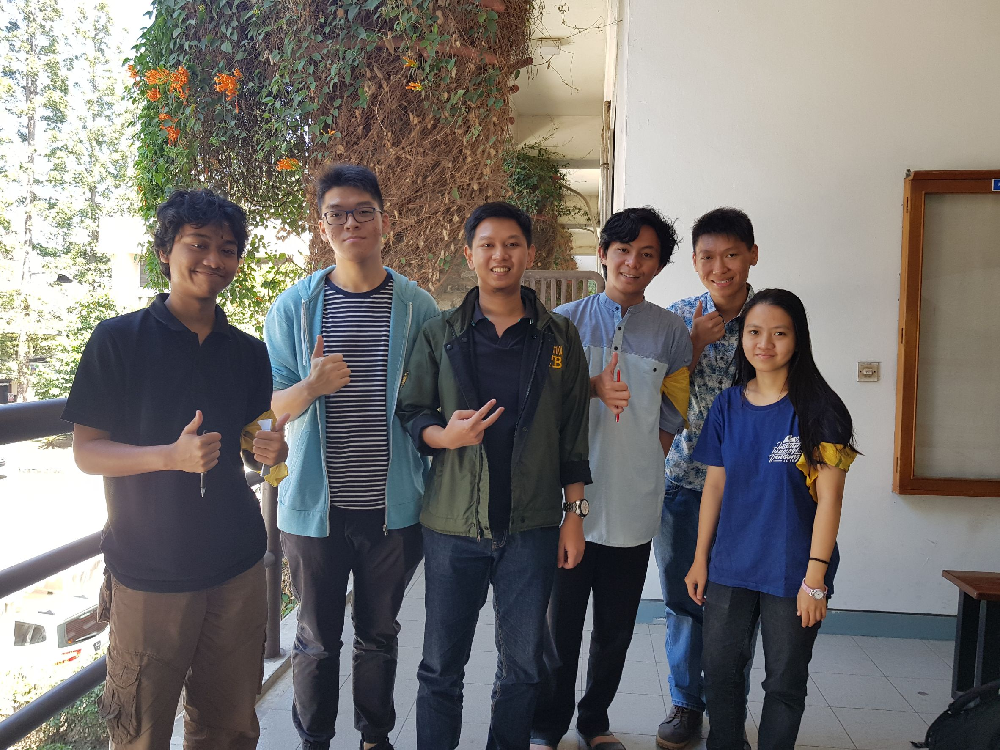

# Wawancara Daemon 'Base32'
Pada hari Jumat, 23 Agustus 2019 jam 10:00, di Selasar Basdat, kami,
- 16518223 - Anna Elvira Hartoyo
- 16518316 - Steve Bezalel Iman Gustaman
- 16518382 - Muh. Muslim Al Mujahid
- 16518377 - Rifaldy Aristya Kelana
- 16518400 - Muhammad Fauzan Rafi Sidiq Widjonarto

mewawancarai Kak Sulthan Mahdi Muhammad D sebagai Daemon.

# Biodata Singkat
Kami mewawancarai Daemon yang bernama Sulthan Mahdi Muhammad D yang biasa dipanggil Kak Sulthan. Kak Sulthan adalah mahasiswa jurusan Sistem dan Teknologi Informasi. Di HMIF, Kak Sulthan menduduki posisi staff di Departemen Internal khususnya Kekeluargaan yang beberapa program kerjanya adalah nonton bareng bersubsidi (supaya banyak yang datang), mengucapkan ulang tahun, dan acara-acara lain bersama sepert buka puasa bareng. Alasan Kak Sulthan mau masuk bidang ini adalah karena ia ingin lebih dekat dengan teman-teman HMIF dan juga mendekatkan teman-temannya. Saat ini di Arkavidia 6.0, Kak Sulthan memiliki jabatan sebagai Kepala bidang Operasional, alasannya karena memang ia sudah sering mengambil bidang operasional pada acara-acara lain seperti SPARTA tahun sebelumnya dan pemilu. Pada dasarnya operasional itu bekerja untuk menyediakan segala kebutuhan demi keberlangsungan acara. Saat ini, bidang operasional masih menunggu kebutuhan dari bidang-bidang lain yang membutuhkan.

# Pertanyaan Bebas
Kami sempat bertanya bagaimana cara Kak Sulthan meng-handle jika menghadapi ke-chaos-an kuliah. Menurut Kak Sulthan, itu bisa diatasi dengan kerja bersama, kumpul di suatu tempat dan bertukar pikiran. Misalnya ngoding bersama sambil makan.

Kami juga sempat bertanya mengenai tips-tips yang bisa Kak Sulthan berikan selama kuliah. Menurutnya banyak-banyak belajar, dengarkan dosen, tapi jangan lupa harus juga berorganisasi. Semakin tingkat atas, ke-chaos-an dan kemageran juga akan semakin meningkat, oleh karena itu, banyak-banyak beraktivitas di tingkat awal.

Sebagai bagian dari internal khususnya kekeluargaan kak sulthan juga kadang menemukan orang yang kadang bersikap lebih individual, lalu kami bertanya bagaimana kak sulthan menghadapi orang-orang yang seperti itu, kak sulthan menjawab dengan membuat kegiatan dan event yang menarik yang bahkan orang itu akan berfikir sayang untuk dilewatkan misalkan, nonton bareng dengan subsidi dari HMIF san sebagainya

