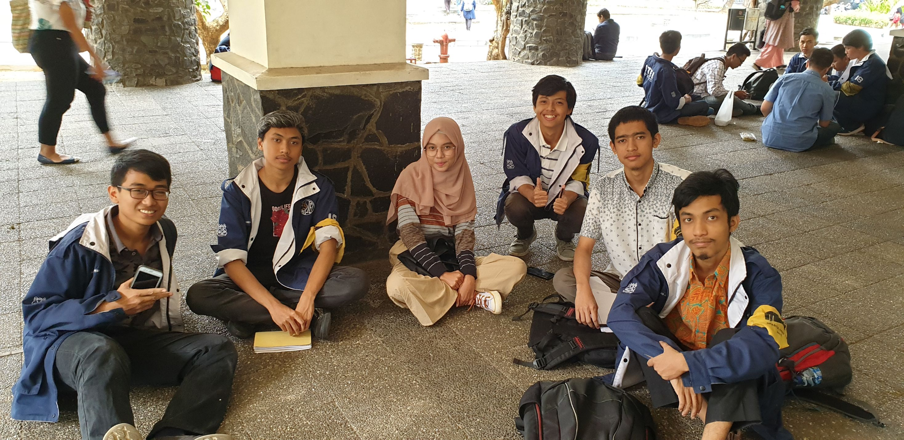

# Kak Nabila Rahmi Utami a.k.a. otp
Senin, 26 Agustus 2019

- 
- 
- 16518242 - Naufal Prima Yoriko 
-
-  

# Tentang Kak Nabila
Nama lengkapnya ..... *lanjutin ya gengs peran hmif (proker jg), arkav, dll.*

## Peran di HMIF
*di sini isi proker dan why ngambil itu peran serah deh, ganti pun issoke*

# Pertanyaan Bebas
Pengalaman paling seru di HMIF setelah lantik adalah saat makrab di akhir smt empat. Waktu itu dibuat makrab yang aslinya tidak ada karena ada kekhawatiran tidak ada momen yang terkenang di HMIF, karena saat ditanya demikian mayoritas menjawab sparta. Oleh karenanya dibuat acara makrab yang aslinya persiapannya cukup dadakan, panitia baru dibentuk h-7 dan itu pun tidak banyak. Akhirnya terlaksana makrab tiu dengan dihadiri sekitar 80an orang.

Menurut kak Nabila, dalam HMIF antara angbis dan angmut terasa ada gap. Sebab, angmut mereka memilih untuk tidak menjadi angbis, dengan tidak ikut sparta, terlebih tidak terlalu saling mengenal seperti mereka yang ikut sparta. Namun saat urasan di kelas, gap tersebut tidak terasa, hanya saat berhimpun saja. Walaupun mungkin antara IF-STi tidak terlalu mengenal jika tidak ikut sparta.

# Foto

