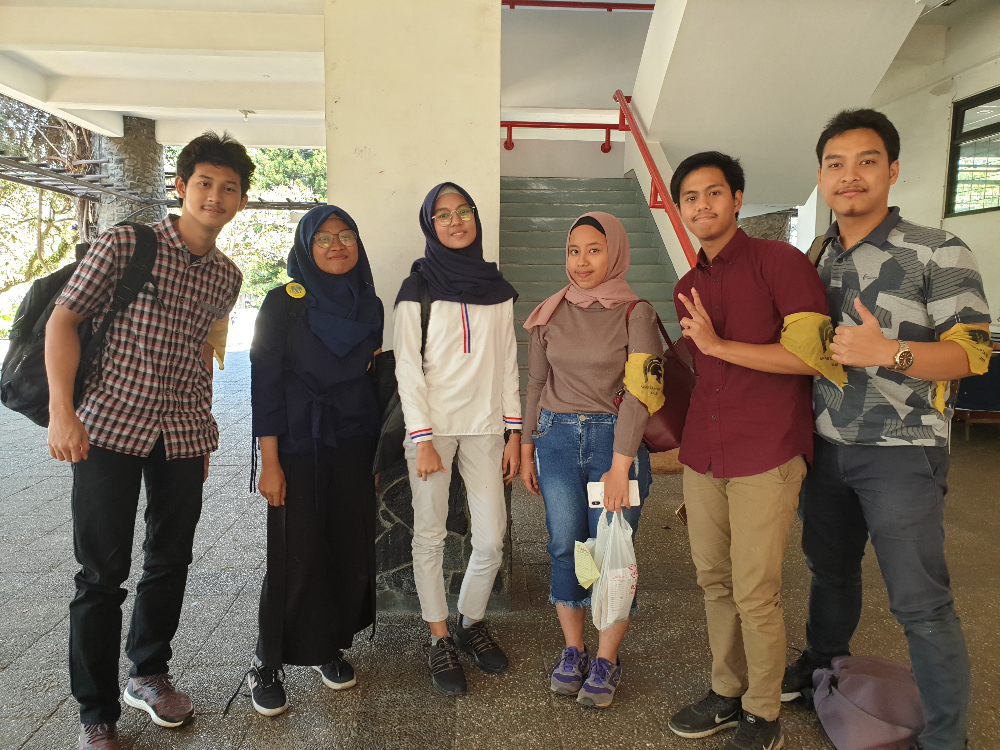

## Biodata
Kak Nabila Rahmi Maulida, akrab dipanggil Kak Nabila, merupakan mahasiswa jurusan STI 2016. Kak Nabila menjabat sebagai CFO IIT di HMIF loh. Alasan kak Nabila mau jadi CFO IIT karena dulu kak Nabila pernah jadi sekretaris, sehingga berpengalaman dalam masalah data untuk menjadi CFO IIT. Beberapa proker kak Nabila sebagai CFO IIT yaitu pembukuan aliran keuangan, pembukaan rekening baru buat IIT, dan transparansi aliran keuangan (publikasi proyek yang masuk setiap 3 bulan). Kerennya kak Nabila itu menjabat sebagai CFO IIT yang terbilang sesuatu yang baru di HMIF, ketika umur kak Nabila 19 tahun. Sebuah fun fact lain yaitu kak Nabila ini kelahiran Juni
2000, setidaknya lebih muda dari 3 orang dari kami yang mewawancarai kak Nabila saat itu.

## Pertanyaan bebas

Kak Nabila memang punya hobi renang, tapi gak daftar URPA, malah daftar Nautika (unit selam). Tetapi, kak Nabila gak ngelanjutin ceritanya
berada di Nautika karena capek buat ngikutin kadernya. Kak Nabila juga suka makan seafood loh, seafood apa aja pokoknya kak Nabila suka.
Sepertinya kak Nabila emang suka sama yang berbau-bau laut yaa. Oh iya, hobi lain kak Nabila selain renang adalah membaca buku fiksi. Ia membaca buku Bumi Manusia karya Pramoedya Ananta Toer, dan kak Nabila sudah nonton juga filmnya, tetapi kak Nabila kecewa soalnya yang main Iqbaal hehe. Ia juga merasa filmnya agak membosankan karena ia melihat jam ketika berada di dalam bioskop.

Kak Nabila punya role model di HMIF, namanya Kak Agung, yang merupakan mahasiswa Teknik Informatika tahun 2015. Kak Nabila menganggapnya keren karena Kak Agung bisa menyeimbangkan akademis dan non - akademis, IPK nya hampir 4 sejauh ini, magang part time, dan juga selalu mendorong diri hingga limit!

Kak Nabila ingin menikah pada umur 25 tahun, karena menurutnya, setelah lulus kuliah pada usia 20 tahun, ia ingin travelling (jalan-jalan), belajar masak dan piano. Menurutnya, penting untuk menikmati momen sebelum menikah, karena setelah menikah, ruang gerak akan lebih terbatas dan akan memiliki tanggung jawab lebih. Orang tua kak Nabila juga menyarankan umur 25 tahun untuk kak Nabila menikah, lho.

[Lanjutin Gan]

Foto dari kiri ke kanan : Rafi, Lia, kak Nabila, Betsy, Ilman, Bagas
