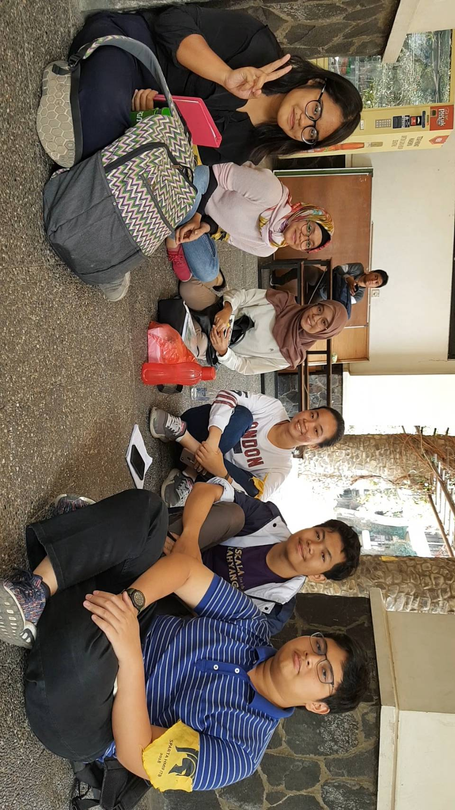

# Kak Nabila Rahmi Maulida a.k.a. OTP
Kamis, 22 Agustus 2019

- 16518065 - Naomi Yolanda
- 16518128 - Elisabeth Levana
- 16518181 - Alya Mizani
- 16518214 - Muhamad Ihza Faida Akbar
- 16518249 - Muhamad Hudan Widzamil

# Tentang Kak Nabila
Nama lengkapnya Nabila Rahmi Maulida dan biasa dipanngil Kak Nabila. Jurusannya Sistem dan Teknologi Informasi angkatan 2016. 

## Peran di HMIF
Kak Nabila saat ini merupakan CFO untuk departemen IIT. Di kepengurusan sebelumnya belum ada divisi yang khusus menghandle keuangan departemen IIT. Sehingga di kepengurusan saat ini dibuat CFO IIT yang akan menghandle bagian keuangan IIT. Kak Nabila yang di kepengurusan sebelumnya merupakan sekretaris, merasa tertarik untuk masuk ke CFO IIT karena merupakan pengalaman baru bagi kak Nabila. Oh iya, di peran ini tuh kak Nabila mempunyai beberapa program kerja, yang pertama yakni Pembukuan, nah maksud pembukuan disini tuh ya pembukuan keuangan di Inkubator IT ini, lalu proker selanjutnya ialah publikasi transparasi proyek, nah jadi di proker ini tuh dia memberitahukan ke warga HMIF mengenai transparasi proyek, misalkan berapa budget client dan lain-lainnya, dan proker terakhirnya yakni ngurus rekening Inkubator IT. 

# Pertanyaan Bebas
Kak Nabila lebih tertarik ke bidang product/project management dan business analyst ketimbang software engineer karena ia kurang menyukai ngoding. Pada bidang product ataupun project management itu sendiri, Kak Nabila sudah mengikuti berbagai perlombaan. Sementara untuk business analyst, Kak Nabila mengambil bidang tersebut saat ia magang di Dekoruma.

Saran dari kak Nabila mengenai persiapan magang, berdasarkan pengalaman Kak Nabila yaitu mempersiapkan CV yang bagus dan coba apply saja ke berbagai perusahaan sebanyak mungkin yang kita bisa. Mengapa? Agar peluang kita dipanggil oleh perusahaan lebih besar dibanding jika hanya apply ke satu perusahaan. Untuk membuat CV yg bagus, sebaiknya ada prestasi-prestasi yang kita tuliskan dari hasil lomba yang kita ikuti. Jika tidak ada prestasi, maka sangat disarankan untuk membuat self-project agar isi CV tidak kosong, dan perusahaan akan lebih tertarik setelah melihat potensi kita.

Kak Nabila juga berpesan bahwa platform untuk daftar internship tidak terbatas hanya dari millis, tapi kita juga bisa mencari info-info internship sendiri melalui aplikasi seperti Google, dan Linkedin. Kuncinya kita sendiri yang harus giat dan rajin untuk mencari info mengenai internship, jangan bergantung pada orang lain.

Menurut Kak Nabila, hal penting yang harus dilakukan adalah mengenal kakak-kakak tingkat. Hal ini dapat dilakukan saat SPARTA. Apa sih pentingnya mengenal kating? Dengan mengenal kating, kita dapat mengetahui tentang tips and trick saat perkuliahan ataupun di himpunan, selain tips and trick kita juga dapat mengetahui pengalaman-pengalaman kating-kating saat magang ataupun kuliah praktik, dan lain-lain. SPARTA sebenarnya merupakan wadah untuk kating dan mahasiswa jurusan baru untuk saling mengenal.

Menurut kak Nabila, mata kuliah layanan STI merupakan mata kuliah tersulit di jurusan STI. Sebenarnya terasa sulit karena terdapat tugas yang lumayan bikin keos, dan diperburuk dengan keadaan anak-anak STI yang males ngoding. Salah satu kelemahan anak STI yang dirasa kak Nabila juga berada di bidang ngoding ini. Karena menurut kak Nabilan, anak STI banyak yang akan skip apabila terdapat tugas ngoding.

Untuk pandangan kak Nabila sendiri perihal gabut atau tidaknya STI sebenarnya tergantung ke semesternya juga. Untuk kurikulum lama yang kak Nabila dan teman-temannya pakai, semester 3 memang rasanya gabut. Sehingga menurut kak Nabila mengambil 24 SKS yang paling efektif adalah di semester 3. Meskipun demikian, di semester berikutnya keosnya STI semakin terasa.

Berdasarkan yang ditemui oleh kak Nabila, biasanya tingkat banyak atau tidaknya proyek di Inkubator IT itu relatif. Di waktu libur kuliah seperti bulan Juni sampai Agustus dan liburan akhir tahun tidak terlalu banyak proyek yang masuk ke Inkubator IT alias sepi. Namun di bulan-bulan seperti Oktober hingga November jadi ada banyak proyek masuk ke Inkubator IT. Selain itu pada waktu sekitaran sebelum Juli alias waktu dekat-dekat penyelesaian Tugas Akhir juga ramai.

Dari yang kak Nabila ketahui, terdapat cukup banyak mahasiswa STI yang magang maupun berkarier di bidang pengembangan software (*software engineering*). Walaupun *software engineering* bukanlah hal yang paling ditekankan di STI tidak masalah bagi *employer* karena sebelumnya ada *screening* dan tes daring terlebih dahulu. Selain itu mereka yang fokus ke *software engineering* mencantumkan juga *courses* yang terkait pada CV mereka.

Lalu, kak Nabila ini sendiri beranggapan tidak batasan untuk kita berkembang, seperti halnya apabila ingin memiliki fokus pada sebuah bidang lomba di IT misal, lalu ada keinginan pula untuk memenuhi prasyarat magang di Start Up yang sudah cukup besar bahkan Unicorn, ia bilang bahwa kalau bisa dilakukan dua - duanya mengapa tidak, karena ia juga memiliki anggapan bahwa ingin berkembang saat magang, justru sebaiknya mencari start up yang sedang merintis, karena disana kita bisa diberi pekerjaan yang cukup berat.

Oh iya, kak Nabila ini juga dulunya aktif di unit TEC (Techno Entrepreneur Club) ITB, dan di unit tersebut ia pernah memegang jabatan Kepala Divisi External Relation.

# Kesan Kak Nabila
Kak Nabila banyak nasihat tentang apa hal-hal bermanfaat apa saja yang harus kita lakukan selama masih kuliah, agar waktu kuliah kita terasa lebih bermakna. Kak Nabila juga sangat lembut dan punya skill komunikasi yang oke.

# Foto

